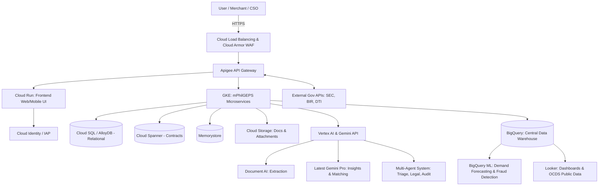

# Business Requirements Document (BRD)
## Modernized Philippine Government Electronic Procurement System (mPhilGEPS)
**Target Cloud Platform:** Google Cloud Platform & Google AI Stack

---

## 1. Executive Summary
This Business Requirements Document (BRD) translates the Terms of Reference (TOR) for the mPhilGEPS modernization—ensuring compliance with the New Government Procurement Act (RA 12009 / NGPA)—into actionable business and technical requirements. Based on the analysis of the TOR and current operations of the Procurement Service (PS-DBM), this BRD maps core functionalities, APP-CSE workflows, Virtual Store mechanics, and next-generation Artificial Intelligence (AI) asks to the **Google Cloud Stack**. It places a heavy emphasis on **Gemini 2.x/3.x models, Gemini Enterprise, Vertex AI, Document AI, and multi-agent systems via Agent Platform**.

## 2. Business Objectives & Project Background
### 2.1 Background
The PS-DBM currently operates dual systems (PhilGEPS 1.5 and mPhilGEPS). The modernization aims to fully transition to a single, centralized mPhilGEPS platform, eliminating redundancy, reducing maintenance costs, and meeting the technological demands of RA 12009.

### 2.2 Core Business Objectives
*   **Compliance & Transparency:** Strictly adhere to the New Government Procurement Act (RA 12009), Open Contracting Data Standard (OCDS), and Open Government Partnership (OGP) commitments.
*   **Centralization & Transition:** Seamlessly transition all merchants, agencies, and workflows into a unified mPhilGEPS centralized ecosystem.
*   **Modernization of Facilities:** Fully roll out the Virtual Store, eMarketplace, e-Reverse Auction, and automated APP-CSE (Annual Procurement Plan - Common-Use Supplies and Equipment) submissions across Regional and LGU Depots.
*   **Intelligent Automation:** Embed next-generation AI (Google's latest Gemini Pro/Ultra models) at the core of the procurement lifecycle for massive document verification, real-time fraud detection, predictive demand forecasting, and agent-driven stakeholder support.

---

## 3. Key Stakeholder Personas & Roles

*   **Procuring Entities (Government Agencies, LGUs, SUCs):** 
    *   *Role:* Create bid notices, evaluate proposals, submit APP-CSEs, and utilize the Virtual Store/eMarketplace for purchasing.
*   **Merchants / Suppliers:** 
    *   *Role:* Register via GOP-OMR (Platinum Membership), upload compliance documents, submit e-bids, participate in e-Reverse Auctions, and maintain digital catalogs in the eMarketplace.
*   **PS-DBM Administrators & Depot Managers:** 
    *   *Role:* Manage regional and LGU depots, oversee eMarketplace inventory, validate supplier documents, review procurement anomalies, and manage the underlying application configurations.
*   **Civil Society Organizations (CSOs) & Auditors (COA):** 
    *   *Role:* Act as observers in the procurement process. Monitor procurement activities via the Observer Module, generate audit trails, and access open data dashboards.

---

## 4. Core Functional Requirements & Google Cloud Mapping

| Functional Module | Detailed Capabilities | Google Cloud Service Mapping |
| :--- | :--- | :--- |
| **Subscriber Registry & GOP-OMR** | Manage users (Suppliers, Procuring Entities, Auditors). Handle DTI/SEC/BIR integration for Platinum Memberships. | **Cloud SQL (PostgreSQL) / AlloyDB** (Relational Data), **Cloud Storage** (Uploaded certificates). |
| **APP-CSE Submission Portal** | Agencies submit annual procurement plans. Supports CSV/Excel ingestion. Track budgets and approval workflows. | **Cloud Run / GKE** to handle peak submission loads seamlessly. |
| **Virtual Store & eMarketplace** | E-commerce storefront for Common-Use Supplies. Logistics tracking, payment gateways, and shopping carts. | **GKE** (highly scalable microservices), **Memorystore (Redis)** for sub-millisecond catalog caching. |
| **e-Bidding Facility (PR, EBB)** | End-to-end electronic bidding. Secure virtual bid boxes, automated Notice of Award (NOA) / Notice to Proceed (NTP). | **GKE**, **Eventarc** for bid-status triggers, **Cloud KMS** (to seal and encrypt bid boxes until opening time). |
| **Contract Management** | Monitor contracts, milestones, POs, liquid damages, and amendments. | **Cloud Spanner** for high-consistency, globally synchronized ledger of contract states. |
| **e-Reverse Auction** | Real-time competitive downward bidding for specialized procurements. | **Firebase / Firestore** for real-time websocket synchronization during live auctions. |
| **Observer Module** | Read-only access for CSOs/COA to track procurement stages, submit observation reports, and flag anomalies. | **Looker Embedded** for secure, read-only data access and reporting. |
| **Integration System (API)** | Real-time synchronization with BTMS, SEC, BIR, DTI, PCAB. | **Apigee API Management** (Secure, throttled, monitored API Gateway with OAuth 2.0). |

---

## 5. Next-Generation AI & Advanced Analytics Strategy

To address the TOR's mandate for Artificial Intelligence, the architecture utilizes Google's latest **Gemini Enterprise Agent Platform, Vertex AI, and Multi-Agent Orchestration**.

### 5.1 Multi-Agent Procurement Support & Chatbot
*   **Gap Addressed:** High volume of complex helpdesk queries, navigation issues, and legal clarifications regarding RA 12009.
*   **Google AI Solution:**
    *   **Gemini Enterprise Agent Platform:** Deploy a specialized Multi-Agent System (MAS). 
        *   *Agent 1 (Triage):* Powered by Dialogflow CX to handle deterministic routing (password resets).
        *   *Agent 2 (Procurement Legal Expert):* Powered by the latest **Gemini Pro model**, utilizing RAG over PhilGEPS manuals and RA 12009 laws to answer complex procedural questions.
        *   *Agent 3 (Technical Support):* Assists users in navigating the APP-CSE submission portal via step-by-step interactive guidance.

### 5.2 Automated Document Verification & Compliance Checking
*   **Gap Addressed:** Manual verification of massive merchant eligibility dossiers (Audited Financial Statements, Tax Clearances, PCAB Licenses) is error-prone and severely bottlenecks vendor accreditation.
*   **Google AI Solution:**
    *   **Google Cloud Document AI:** Custom extractors ingest identity, business, and financial documents, outputting structured, highly accurate JSON data.
    *   **Gemini Multimodal Processing:** Utilize the massive context window of the latest Gemini models to cross-reference a vendor's uploaded Technical Proposal against the Procuring Entity's exact TOR specifications. The model automatically flags missing requirements, inconsistencies, or expired validity dates.

### 5.3 AI-Powered Insights & UNSPSC Auto-Classification
*   **Gap Addressed:** Inaccurate item classification by agencies leads to poor supplier matching and skewed analytics.
*   **Google AI Solution:** 
    *   **Gemini Enterprise API:** Embed semantic matching into the APP-CSE and PR creation flows. When a user types an unstructured bid description, Gemini auto-suggests the most accurate United Nations Standard Products and Services Code (UNSPSC).
    *   **Vertex AI Search:** Allow procurement officers to perform semantic, natural-language searches over years of historical bid documents to establish reference pricing and draft better TORs.

### 5.4 Predictive Analytics for Demand Forecasting
*   **Gap Addressed:** Prevent stockouts of Common-Use Supplies across Main, Regional, and LGU Depots.
*   **Google AI Solution:**
    *   **BigQuery ML:** Execute `ARIMA_PLUS` and multivariate time-series forecasting models directly on historical APP-CSE and Virtual Store transactional data.
    *   **Vertex AI Forecast:** Train high-accuracy models factoring in external variables (e.g., typhoon seasons, budget release cycles) to optimize dynamic depot inventory allocation.

### 5.5 Fraud Detection, Collusion Prevention & Red Tagging
*   **Gap Addressed:** Detecting bid rigging, collusion rings, or suspicious pricing behaviors across millions of data points.
*   **Google AI Solution:**
    *   **Vertex AI (Custom ML Models):** Train anomaly detection models (e.g., Isolation Forests) to continuously score bids for unusual behaviors, sudden price drops/spikes, or abnormal vendor activity.
    *   **Google Cloud Graph / BigQuery:** Map beneficial ownership (SEC/DTI data) to detect hidden corporate links between supposedly competing bidders.
    *   **Agent Platform (Auditor Agent):** An AI agent that synthesizes anomaly alerts into natural-language narrative investigative summaries for the COA or PS-DBM Evaluation Team, citing specific suspicious data points.

### 5.6 Enhanced Data Analytics & Open Data
*   **Gap Addressed:** Lack of transparent, real-time, public-facing dashboards for CSOs, journalists, and citizens to monitor government spending.
*   **Google AI Solution:**
    *   **Looker & Looker Studio:** Build interactive, embeddable dashboards exposing Open Contracting Data Standard (OCDS) datasets to the public.
    *   **Gemini in Looker / BigQuery:** Empower non-technical users (e.g., agency heads) to ask natural language questions (e.g., *"Show me the average bid variance for IT equipment in Q3 2026 across LGUs"*) and instantly generate accurate SQL and visualizations.

---

## 6. High-Level Architecture Diagram

---

## 7. Non-Functional & Service Level Requirements (SLA)

*   **Security & Compliance:**
    *   **Encryption:** **Cloud Key Management Service (KMS)** handles encryption keys for data at rest and in transit. Bid boxes are cryptographically sealed until bid opening.
    *   **WAF & DDoS Protection:** **Google Cloud Armor** protects against OWASP Top 10 vulnerabilities, brute-force attacks, and massive DDoS attempts (as mandated in Annex F & G).
    *   **Audit Trail:** Immutable audit logging of all sensitive transactions routed to **Cloud Logging** and **BigQuery**.
*   **High Availability & Capacity (Annex C & D):**
    *   **Target Load:** Architecture must support peak concurrent users of 3,500 - 5,500 daily.
    *   **Uptime SLA:** 99.9% uptime (24x7 operation) utilizing a multi-region Active-Passive or Active-Active deployment model.
    *   **Performance:** Full page display (including CSS/JS payloads) guaranteed within 5 seconds during peak loads, heavily leveraging Cloud CDN and Memorystore.
*   **Data Standards (OCDS / Open Data):**
    *   Expose public datasets for Civil Society Organizations (CSOs) natively outputting JSON, CSV, and XML via BigQuery data sharing and Looker embedded analytics.

---

## 8. Implementation Phasing Strategy

1.  **Phase 1: Inception & Prototyping (Months 1-3):** Finalize infrastructure foundation on GCP. Develop rapid prototypes of the Multi-Agent Chatbot for the Virtual Store and Document AI pipelines for GOP-OMR.
2.  **Phase 2: Core Modernization (Months 4-12):** Build the GKE microservices for the eMarketplace, Virtual Store, and APP-CSE submission portals. Establish Apigee API tunnels to BIR/SEC.
3.  **Phase 3: Intelligence Injection (Months 13-18):** Overlay Vertex AI, BigQuery ML, and Gemini Agents onto the transactional data to activate fraud detection, UNSPSC classification, and predictive forecasting for Depots.
4.  **Phase 4: UAT & Security Hardening (Months 19-24):** Extensive User Acceptance Testing. Vulnerability Assessment and Penetration Testing (VAPT) via Cloud Armor and Security Command Center.
5.  **Phase 5: Go-Live, Training & Operations (Months 25-36):** Full public rollout. 24/7 Monitoring using Google Cloud Operations Suite (Cloud Monitoring, Logging). Comprehensive change management and training for LGUs and NGAs.
