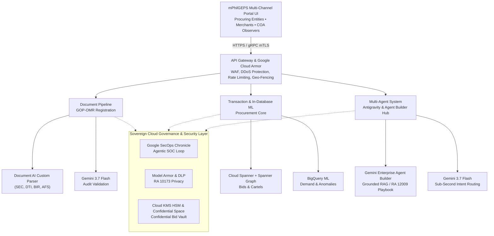

# Business Requirements Document (BRD)
## Modernized Philippine Government Electronic Procurement System (mPhilGEPS) Phase 2
**Target Cloud Platform:** Google Cloud Platform, Gemini Enterprise & Google Sovereign AI Stack  
**Reference Document:** Terms of Reference (TOR) & PS-DBM Gemini Requirements Architecture v1.0

---

## 1. Executive Summary & Architectural Thesis

This Business Requirements Document (BRD) translates the Terms of Reference (TOR) for the mPhilGEPS modernization into actionable business, technical, and regulatory requirements compliant with the **New Government Procurement Act (RA 12009 / NGPA)** and the **Data Privacy Act (RA 10173)**.

### 📌 Core Architectural Thesis
Rather than bolting disparate third-party AI APIs onto legacy relational databases, **mPhilGEPS Phase 2 leverages in-database AI processing (BigQuery ML and Spanner Graph) paired with Gemini 3.1 Pro (heavy reasoning) and Gemini 3.7 Flash (sub-second transactional inference)**. 

This architecture maintains end-to-end sovereign data residency under RA 10173, isolates unopened bids cryptographically inside a Confidential Space vault, and scales seamlessly to support peak loads exceeding **5,500 concurrent users** with sub-second responsiveness.

---

## 2. Business Objectives & Project Background

### 2.1 Background
The Procurement Service – Department of Budget and Management (PS-DBM) currently operates dual systems (PhilGEPS 1.5 and mPhilGEPS). The modernization aims to fully transition to a single, centralized mPhilGEPS platform, eliminating redundancy, reducing maintenance costs, and meeting the technological demands of RA 12009.

### 2.2 Core Business Objectives
*   **Compliance & Transparency:** Strictly adhere to the New Government Procurement Act (RA 12009), Open Contracting Data Standard (OCDS), and Open Government Partnership (OGP) commitments.
*   **Centralization & Transition:** Seamlessly transition all merchants, agencies, and workflows into a unified mPhilGEPS centralized ecosystem.
*   **Modernization of Facilities:** Fully roll out the Virtual Store, eMarketplace, e-Reverse Auction, and automated APP-CSE (Annual Procurement Plan - Common-Use Supplies and Equipment) submissions across Regional and LGU Depots.
*   **Intelligent In-Database Automation:** Embed Google's latest Gemini 3.x models (Gemini 3.1 Pro & Gemini 3.7 Flash) directly alongside transactional storage (Spanner Graph & BigQuery ML) for massive document verification, real-time collusion detection, predictive demand forecasting, and agentic stakeholder support.
*   **Sovereign Cloud Governance:** Enforce Zero-Trust security, an Autonomous Agentic SOC (Google SecOps / Chronicle), and confidential computing enclaves for market-sensitive bidding data.

---

## 3. Key Stakeholder Personas & Roles

*   **Procuring Entities (Government Agencies, LGUs, SUCs):**
    *   *Role:* Create bid notices, evaluate technical/financial proposals, submit annual APP-CSEs, and execute bulk purchases via the Virtual Store and eMarketplace.
*   **Merchants / Suppliers:**
    *   *Role:* Register via GOP-OMR (Red and Platinum Membership tiers), upload compliance documents, submit encrypted e-bids, participate in live e-Reverse Auctions, and maintain digital catalogs.
*   **Bids and Awards Committee (BAC) & Secretariat:**
    *   *Role:* Formulate tender evaluation criteria, review compliance reports, conduct pre-bid conferences, unseal bid boxes via cryptographic quorum, and issue Notices of Award (NOA) / Notices to Proceed (NTP).
*   **PS-DBM Administrators & Regional/LGU Depot Managers:**
    *   *Role:* Manage regional depot inventories, oversee eMarketplace logistics, validate supplier credentials, review procurement anomalies, and manage system operations under a 3-year SLA.
*   **Civil Society Organizations (CSOs) & Commission on Audit (COA):**
    *   *Role:* Act as independent observers. Monitor procurement activities via the Observer Module, inspect append-only audit ledgers, query collusion indices, and access open contracting data.

---

## 4. Core Functional Requirements & Google Cloud Mapping

| Functional Module | Detailed Capabilities | Google Cloud Service Mapping |
| :--- | :--- | :--- |
| **Subscriber Registry & GOP-OMR** | Manage suppliers, procuring entities, and observers. Automated document extraction & verification (SEC GIS, DTI, BIR Tax Clearance, PCAB). | **Cloud SQL (PostgreSQL) / AlloyDB**, **Document AI (CDE & Form Parser)**, **Gemini 3.7 Flash** (Audit Decisioning), **Cloud Storage**. |
| **Vendor-Tender Matching** | Proactive supplier notification upon Invitation to Bid (ITB) publication. | **Vertex AI Vector Search** with `text-embedding-005` (768/1536-dim embeddings over GOP-OMR merchandise profiles). |
| **APP-CSE Submission Portal** | Ingestion of agency procurement plans (.xlsx/.pdf). Automated line-item extraction, budget ceiling checks, and UNSPSC classification. | **Cloud Run / GKE Autopilot**, **Gemini 3.7 Flash** (Semantic Normalization), **Gemini 3.1 Pro** (Hierarchical UNSPSC Enforcement). |
| **Virtual Store & eMarketplace** | E-commerce storefront for Common-Use Supplies. Logistics tracking, payment gateways, and shopping carts. | **GKE Autopilot**, **Memorystore (Redis)** for sub-millisecond catalog caching & distributed reservation locks. |
| **Confidential e-Bidding Facility** | End-to-end two-envelope electronic bidding. Sealed virtual bid vaults, automated NOA/NTP workflows. | **Confidential Space on Confidential VMs**, **Cloud KMS HSM** (Dual-control quorum unsealing), **Eventarc**. |
| **e-Reverse Auction** | Ultra-low-latency competitive downward bidding with 2-minute anti-sniping clock extensions. | **Firebase / Firestore** & **Redis Sorted Sets (`ZSET`)** for real-time WebSocket state synchronization. |
| **Anti-Collusion & Cartel Detection** | Multi-hop corporate relationship analysis, bid rigging detection, price-fixing pattern recognition. | **Cloud Spanner + Spanner Graph (GQL)**, **BigQuery ML** (Bid Rotation Index & Benford's Law variance). |
| **Depot Demand Forecasting** | Predictive stock replenishment for Main, Regional, and LGU Depots factoring in PH holidays and fiscal cycles. | **BigQuery ML (`ARIMA_PLUS`)** with `holiday_region = 'PH'`, **Vertex AI Pipelines** (Kubeflow MLOps). |
| **Observer & Open Data Module** | Immutable public and audit access for CSOs and COA. OCDS format export (JSON, CSV). | **BigQuery** (Immutable append-only audit tables), **Looker Embedded**, **Gemini in Looker / BigQuery**. |
| **External Integration Gateway** | Real-time synchronization with BTMS, SEC, BIR, DTI, and PCAB. | **Apigee API Management** (OAuth 2.0, mTLS, rate limiting, and analytics). |
| **Sovereign Security & Agentic SOC** | Continuous ingestion of EPS telemetry, brute-force mitigation, DLP for RA 10173, prompt injection defenses. | **Google SecOps (Chronicle)**, **Gemini Agentic SOC Loop**, **Google Cloud Model Armor**, **Cloud Armor WAF**. |

---

## 5. Next-Generation AI & Advanced Analytics Strategy

To operationalize RA 12009, mPhilGEPS integrates Google’s cutting-edge **Gemini 3.x models, in-database AI processing, and multi-agent systems**.



### 5.1 AI-Powered Procurement Insights & Hierarchical UNSPSC Classification
*   **Gap Addressed:** Inconsistent, colloquial item descriptions in Annual Procurement Plans (APPs) create catalog inaccuracies and corrupt national expenditure reporting.
*   **Dual-Pass Extraction & Classification Pipeline:**
    *   **Pass 1 (Semantic Normalization via Gemini 3.7 Flash):** Rapidly parses raw item titles, technical specs, and units of measure, stripping colloquial jargon and proprietary brand specifics into standardized semantic definitions.
    *   **Pass 2 (Hierarchical Enforcement via Gemini 3.1 Pro):** For complex technical equipment or bundled tenders, Gemini 3.1 Pro executes deep reasoning using strict **Structured Outputs (JSON Schema)** against the official UNSPSC hierarchy:
        $$\text{Segment (XX)} \longrightarrow \text{Family (XX)} \longrightarrow \text{Class (XX)} \longrightarrow \text{Commodity (XX)}$$
    *   **Deterministic Schema Contract:**
        ```json
        {
          "unspsc_code": "43211507",
          "hierarchy": {
            "segment": "Information Technology Broadcasting and Telecommunications",
            "family": "Computer Equipment and Accessories",
            "class": "Computers",
            "commodity": "Desktop computers"
          },
          "confidence_score": 0.985,
          "extracted_specifications": {
            "form_factor": "Small Form Factor (SFF)",
            "processor_class": "Enterprise 16-Core",
            "memory_gb": 32
          }
        }
        ```
*   **Vendor-Tender Matching (Vertex AI Vector Search):**
    *   Historical bid awards and GOP-OMR merchant merchandise profiles are embedded using `text-embedding-005` (768 or 1536 dimensions) and indexed in Vertex AI Vector Search.
    *   Upon publication of an Invitation to Bid (ITB), the engine computes nearest neighbors within milliseconds to proactively push notifications to qualified suppliers.

---

### 5.2 Predictive Analytics & Public Demand Forecasting
*   **Gap Addressed:** Artificial budget exhaustion and regional stockouts of Common-Use Supplies and Equipment (CSE) across PS-DBM Main and Regional Depots.
*   **In-Database Time-Series Forecasting (BigQuery ML):**
    *   By executing directly on multi-year transactional datasets inside BigQuery, `ARIMA_PLUS` eliminates data egress risks, keeping fiscal data inside sovereign boundaries.
    *   Accounts for seasonality, Philippine national holidays (`holiday_region = 'PH'`), fiscal year-end spending surges (Q4 rushes), and inflation trends.
    *   **Production SQL Pipeline:**
        ```sql
        CREATE OR REPLACE MODEL `mphilgeps_analytics.app_demand_forecast`
        OPTIONS(
          model_type = 'ARIMA_PLUS',
          time_series_timestamp_col = 'procurement_date',
          time_series_data_col = 'total_expenditure',
          time_series_id_col = 'unspsc_commodity_code',
          holiday_region = 'PH'
        ) AS
        SELECT
          procurement_date,
          unspsc_commodity_code,
          total_expenditure
        FROM
          `mphilgeps_dw.historical_purchase_orders`;
        ```
*   **MLOps via Vertex AI Pipelines (Kubeflow-based):**
    *   Continuously monitors feature drift caused by macroeconomic shocks or executive budget realignments.
    *   Automatically schedules model re-training and updates automated replenishment alerts for standard office supplies and emergency medical stockpiles.

---

### 5.3 Automated Document Verification & Merchant Accreditation (GOP-OMR)
*   **Gap Addressed:** Manual verification of massive merchant dossiers (AFS, Tax Clearances, PCAB Licenses) delays Platinum accreditation by weeks.
*   **Verification Architecture Matrix:**

| Document Type | Extractor Engine | Target Fields for Verification | Statutory Cross-Validation Rule Check |
| :--- | :--- | :--- | :--- |
| **SEC General Information Sheet (GIS)** | Document AI Custom Extractor (CDE) | Corporate Name, SEC Reg No., Board of Directors, Stockholders, Equity Breakdown | Validates against **60/40 Filipino ownership threshold**; flags shared officers/directors with other competing bidding entities. |
| **DTI Business Registration** | Document AI CDE | Business Name, Owner Name, Certificate Scope, Validity Period | Verifies business active status and cross-checks owner against GPPB debarment/blacklist database. |
| **BIR Tax Clearance** | Document AI Form Parser | Tax Clearance No., Certificate Date, Expiration Date, TIN | Validates certificate authenticity via cryptographic barcode and ensures certificate is active on bid date. |
| **PCAB Construction License** | Document AI CDE | License Number, Classification, Category (AAA/AA/A), Expiry Date | Checks that contractor capacity matches or exceeds the Approved Budget for the Contract (ABC). |
| **Audited Financial Statements (AFS)** | Document AI Layout Parser + **Gemini 3.1 Pro** | Current Assets, Current Liabilities, Net Worth, Value of Outstanding Works | Automatically calculates **Net Financial Contracting Capacity (NFCC)**: <br>$$NFCC = [(\text{Current Assets} - \text{Current Liabilities}) \times 15] - \text{Outstanding Works}$$ |

*   **Audit Decisioning Engine:**
    *   **Gemini 3.7 Flash** ingests the aggregated structured JSON from Document AI.
    *   It verifies the mathematical accuracy of the NFCC calculation against the ABC, checks document validity dates against the tender deadline, and marks the application `APPROVED`, `FLAGGED`, or `REJECTED_WITH_REASON`.

---

### 5.4 Multi-Agent Conversational Ecosystem (Google Antigravity & Agent Builder)
*   **Gap Addressed:** Monolithic chatbots fail to handle complex legal inquiries, tender navigation, and audit synthesis across both internal government personnel and external public suppliers.
*   **Dual-Channel Frontend Deployment Flexibility:**
    *   **Channel 1: Gemini Enterprise (Internal Personnel):** Out-of-the-box, enterprise-grade conversational frontend for PS-DBM admins, BAC members, and COA auditors. No custom UI development required; internal stakeholders can interact with the specialized agents directly through Gemini Enterprise web and side-panel extensions inside Google Workspace (Docs, Sheets, Drive).
    *   **Channel 2: Cloud Run (External / Public Portal UI):** Highly scalable, serverless web/mobile chat UI and embeddable web widget deployed on **Cloud Run** for unauthenticated or authenticated external users (merchants, prospective bidders, civil society observers). Scalable to zero when idle, burstable to 5,500+ concurrent sessions during bid-closing surges, and shielded by Cloud Armor WAF and Apigee.
*   **Multi-Agent Topology:**
    *   **Supervisor Agent (Intent Classifier & Router):** Built on Agent Development Kit (ADK) and Gemini 3.7 Flash. Routes user sessions with sub-second latency across specialized agents.
    *   **Merchant Onboarding & Bidding Agent:** Contextually guides prospective bidders through technical and financial package assembly. Executes real-time pre-flight checks (*"Your Omnibus Sworn Statement is missing Annex A"*).
    *   **Bids and Awards Committee (BAC) Advisor Agent:** Grounded in RA 12009 Implementing Rules and Regulations (IRR) and GPPB Standard Bidding Documents. Helps procurement officers draft specifications without anti-competitive brand names, calculate statutory timelines, and formulate objective evaluation criteria.
    *   **Public Transparency & COA Auditor Agent:** Translates natural language questions from COA personnel, journalists, and CSOs into governed SQL/GQL queries (*"Compare bid price variations for flood control projects across Region III in 2025"*).
*   **Grounding via Structured Open Knowledge Format (OKF):**
    *   Standard unstructured RAG yields statutory hallucinations.
    *   Procurement corpora are chunked using OKF with strict metadata tags (`section`, `subsection`, `amendment_date`, `applicability`), guaranteeing 100% citation fidelity.

---

### 5.5 Graph-Based Anti-Collusion, Bid-Rigging & Anomaly Detection
*   **Gap Addressed:** Cartels coordinate submissions using phantom competitors, cover bidding, and circular rotation that bypass standard relational queries.
*   **Spanner Graph Model:**
    *   **Nodes:** `Bidder`, `Director`, `Authorized_Signatory`, `Bank_Guarantor`, `IP_Address`, `Physical_Address`, `Tender`.
    *   **Edges:** `SUBMITTED_FOR`, `SERVES_ON_BOARD`, `REGISTERED_WITH_ADDRESS`, `UTILIZED_NETWORK`, `FINANCIALLY_BACKED_BY`.
    *   **Graph Pattern Detection (GQL in Cloud Spanner):**
        ```sql
        GRAPH MPhilGepsProcurementGraph
        MATCH
          (b1:Bidder)-[:SERVES_ON_BOARD]->(d:Director)<-[:SERVES_ON_BOARD]-(b2:Bidder),
          (b1)-[:SUBMITTED_FOR]->(t:Tender)<-[:SUBMITTED_FOR]-(b2)
        WHERE b1.id != b2.id
        RETURN b1.company_name, b2.company_name, d.full_name, t.reference_number;
        ```
*   **Statistical Anomaly Detection Metrics:**
    *   **Bid Rotation Index (Collusion Probability Index - CPI):** BigQuery ML clustering algorithms analyze historical tender awards within geographic zones. When firms alternate winning bids with statistical precision, the algorithm assigns a high CPI score.
    *   **Benford’s Law & Line-Item Pricing Variance:** Analyzes unit pricing distributions against Benford's Law and flags bids where competing bidders exhibit identical line-item decimal anomalies or synthetic variance patterns.

---

### 5.6 Sovereign Cloud Security, Agentic SOC & Zero-Trust Governance
*   **Confidential Space Bid Vault:**
    *   Unopened bids are classified as market-sensitive state secrets.
    *   Bids are encrypted client-side and stored inside an isolated enclave running on **Confidential VMs (Confidential Space)**.
    *   The decryption key is held inside **Cloud KMS HSM** and cannot be unsealed until the BAC chairperson and COA observers simultaneously sign the digital release token at the bid opening timestamp ($T+0$).
*   **Autonomous Agentic SOC (Google SecOps / Chronicle + Gemini):**
    *   Ingests tens of thousands of electronic procurement system (EPS) telemetry events per second into Google SecOps.
    *   An automated Gemini agent detects brute-force enumeration, abnormal database reads on tender pricing tables, and access attempts originating outside whitelisted sovereign boundaries, initiating real-time quarantine of compromised credentials.
*   **Model Armor & Data Privacy (RA 10173):**
    *   Inline inspection of every LLM prompt and response.
    *   Automatic redaction of Tax Identification Numbers (TIN), mobile numbers, bank account details, and confidential reserve prices from public-facing auditor assistants.
    *   Active defense against prompt injection attacks aimed at manipulating procurement evaluation scores or leaking BAC deliberations.

---

## 6. Gemini Enterprise Standard SKU & Lifecycle Maintenance

To fulfill the TOR’s requirement for a **3-Year System Maintenance Lifecycle** and strict 24/7 SLA:

*   **Antigravity Agentic IDE Workflows:** The PS-DBM software engineering and operations team leverages Antigravity (bundled with Gemini Enterprise Standard) for automated code refactoring, rapid GKE microservice debugging, Spanner Graph query optimization, and CI/CD maintenance.
*   **Workspace Native Productivity:** Procurement officers draft TORs in Google Docs, compare pricing matrices in Google Sheets, and transcribe pre-bid conferences from Google Meet with native Gemini Enterprise assistance.
*   **Zero Model Training Guarantee:** Enterprise agreement guarantees that Philippine sovereign procurement data, confidential bids, and queries are **never** used to train Google foundational models.

---

## 7. Non-Functional Requirements & Performance Sizing Parameters

*   **Concurrency Thresholds:**
    *   **Baseline Traffic:** 3,500 concurrent active sessions.
    *   **Peak Surge Traffic:** 5,500 concurrent sessions during month-end APP-CSE deadlines and bid submission closing windows.
    *   **Infrastructure:** Scaled via **Google Kubernetes Engine (GKE Autopilot)** paired with **Cloud Spanner autoscaling**.
*   **Latency Budget Allocation:**
    *   **Interactive UI Searches & Navigation:** $< 1,000\text{ ms}$ (accelerated by Cloud CDN, Memorystore, and Gemini 3.7 Flash).
    *   **Batch Document Parsing (SEC / GIS / BIR):** Asynchronous Pub/Sub pipeline with WebSocket status notifications ($< 15\text{ seconds}$ per 20-page document).
    *   **High-Complexity Collusion Graph Queries:** Nightly scheduled ETL or on-demand BAC pre-award evaluation jobs ($< 60\text{ seconds}$).
    *   **Page Load SLA:** Full web portal display (including CSS/JS payloads) guaranteed within 5 seconds during peak loads.
*   **Availability & Disaster Recovery:**
    *   **Uptime SLA:** $99.9\%$ (24x7 operation) across Active-Passive multi-region deployment (Primary: `asia-southeast1`, Secondary DR: `asia-southeast2`).
    *   **Recovery Point Objective (RPO):** $< 15\text{ minutes}$.
    *   **Recovery Time Objective (RTO):** $< 1\text{ hour}$ with automated Cloud DNS health check failover.
*   **Audit & Record Retention:**
    *   **10-Year WORM Storage:** Archival of submitted bids and APP-CSE records in Cloud Storage with **Bucket Lock in Compliance Mode** (10-year non-erasable retention) per COA Circulars and RA 12009.
    *   **Immutable Audit Ledger:** Append-only BigQuery audit sink capturing every state transition and administrative action.

---

## 8. Phased Implementation Roadmap

1.  **Phase 1: Inception & Local Subsystems (Months 1–2):** Complete offline APP-CSE parser, UNSPSC dual-pass prototype, local Docker Compose stack, and test fixtures.
2.  **Phase 2: Core Platform & Statutory Gateways (Months 3–6):** Deploy GKE microservices, GOP-OMR Document AI pipelines (SEC/BIR/DTI/PCAB), and Apigee integrations.
3.  **Phase 3: Intelligence Injection & Anti-Collusion (Months 7–12):** Deploy Spanner Graph (cartel detection), BigQuery ML `ARIMA_PLUS` (PH holiday demand forecasting), and ADK Multi-Agent ecosystem.
4.  **Phase 4: Sovereign Security & GCP Demo Validation (Months 13–18):** Implement Confidential Space Bid Vault, Cloud KMS HSM quorum unsealing, Model Armor DLP, and SecOps Agentic SOC loop.
5.  **Phase 5: Production Cutover, UAT & 3-Year Maintenance (Months 19–36):** Final data migration from legacy PhilGEPS 1.5, national agency onboarding, 24/7 SLA monitoring, and continuous Antigravity maintenance.
