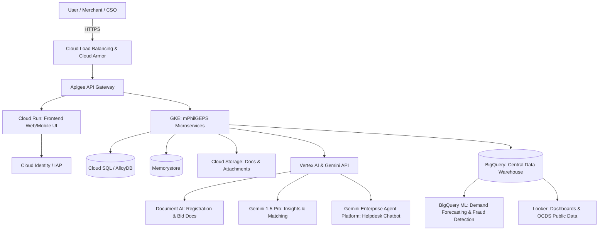

# Business Requirements Document (BRD)
## Modernized Philippine Government Electronic Procurement System (mPhilGEPS)
**Target Cloud Platform:** Google Cloud Platform & Google AI Stack

---

## 1. Executive Summary
This document translates the Terms of Reference (TOR) for the mPhilGEPS modernization (compliance with RA 12009 / NGPA) into actionable business and technical requirements. Based on the analysis of the TOR and current operations (via the official PS-DBM portal), this BRD maps the core functionalities, APP-CSE workflows, Virtual Store mechanics, and Artificial Intelligence (AI) asks to the **Google Cloud Stack**, emphasizing **Gemini, Gemini Enterprise, Vertex AI, Document AI, and Agent Platform**.

## 2. Business Objectives & Key Stakeholders
### 2.1 Objectives
*   **Compliance & Transparency:** Align with the New Government Procurement Act (RA 12009) and Open Contracting Data Standard (OCDS) / Open Government Partnership (OGP) commitments.
*   **Centralization & Transition:** Seamlessly transition from PhilGEPS 1.5 and disjointed manual submissions into a unified mPhilGEPS centralized ecosystem.
*   **Modernization:** Fully roll out the Virtual Store, eMarketplace, e-Reverse Auction, and automated APP-CSE (Annual Procurement Plan - Common-Use Supplies and Equipment) submissions.
*   **Intelligent Automation:** Embed Google's AI at the core of the procurement lifecycle for document verification, fraud detection, predictive demand forecasting, and 24/7 stakeholder support.

### 2.2 Key Stakeholders
*   **Procuring Entities (Government Agencies, LGUs, SUCs):** Submit APP-CSEs, post bid notices, and utilize the Virtual Store/eMarketplace.
*   **Merchants / Suppliers:** Register via GOP-OMR, participate in eBidding, and upload catalogs.
*   **PS-DBM Administrators & Depots:** Manage regional and LGU depots, oversee the eMarketplace, and review procurement anomalies.
*   **Civil Society Organizations (CSOs) & Auditors (COA):** Monitor procurement activities via the Observer Module and open data dashboards.

---

## 3. Core System Modules & Google Cloud Architecture Mapping

| mPhilGEPS Module | Operational Use Case | Google Cloud Service Mapping |
| :--- | :--- | :--- |
| **Subscriber Registry & GOP-OMR** | Centralized merchant and government agency registry (Platinum memberships, DTI/SEC integration). | **Cloud SQL for PostgreSQL / AlloyDB**, **Cloud Storage** for uploaded certificates. |
| **APP-CSE Submission Portal** | Agencies submitting their annual procurement plans for Common-Use Supplies. | **Cloud Run / GKE** to handle peak submission loads (e.g., end-of-year deadlines). |
| **Virtual Store & eMarketplace** | Online shopping platform for Common-Use Supplies linked to Regional/LGU Depots. | **GKE** (scalable e-commerce backend), **Memorystore (Redis)** for fast catalog caching. |
| **e-Bidding Facility** | End-to-end electronic bidding, notices (PR, EBB), and evaluations. | **GKE** (Microservices architecture), **Eventarc** for bid-status triggers. |
| **Contract Management** | Monitoring contracts, milestones, POs, and amendments. | **Cloud Spanner** for high-consistency ledger of contract states. |
| **e-Reverse Auction** | Real-time competitive downward bidding. | **Firebase / Firestore** for real-time websocket synchronization during live auctions. |
| **Integration System (API)** | Integration with BTMS, SEC, BIR, DTI, PCAB, etc. | **Apigee API Management** (Secure, throttled, monitored API Gateway). |

---

## 4. Google Enterprise AI & Advanced Analytics Strategy

The TOR explicitly mandates six (6) minimum AI functionalities. Below is the mapping of these requirements to Google's Enterprise AI Stack to solve actual PS-DBM pain points.

### 4.1 Automated Document Verification (GOP-OMR & eBidding)
*   **Pain Point:** Manual verification of hundreds of thousands of pages of merchant eligibility documents (Audited Financial Statements, Tax Clearances, PCAB Licenses) and Technical Proposals.
*   **Google AI Solution:**
    *   **Google Cloud Document AI:** Use pre-trained or custom extractors to ingest identity and business documents, outputting structured JSON data.
    *   **Gemini 1.5 Pro (Multimodal):** Leverage the 2M token context window to cross-reference a vendor's uploaded Technical Proposal against the Procuring Entity's exact TOR specifications, automatically flagging missing requirements or discrepancies.

### 4.2 AI-Powered Procurement Insights & Classification
*   **Pain Point:** Agencies struggle to classify items correctly under the United Nations Standard Products and Services Code (UNSPSC).
*   **Google AI Solution:** 
    *   **Gemini 1.5 Pro / Vertex AI:** Provide semantic matching. When an agency types an unstructured bid description, Gemini auto-suggests the most accurate UNSPSC classification.
    *   **Vertex AI Search & Conversation:** Allow procurement officers to perform semantic searches over years of historical bid documents to find reference pricing and previous successful TORs.

### 4.3 Chatbot and Virtual Assistant Support
*   **Pain Point:** High volume of helpdesk queries regarding PhilGEPS navigation, APP-CSE submission guidelines, and RA 12009 legalities.
*   **Google AI Solution:**
    *   **Gemini Enterprise Agent Platform:** Deploy a "Procurement Assistant Agent" grounded in PhilGEPS user manuals, RA 12009, and GPPB resolutions (RAG - Retrieval-Augmented Generation).
    *   **Dialogflow CX:** Handle deterministic routing (e.g., password resets, ticket generation) while handing off to the Gemini Agent for complex, open-ended procedural questions.

### 4.4 Predictive Analytics for Demand Forecasting
*   **Pain Point:** PS-DBM needs to anticipate demand across its Main, Regional, and LGU Depots to avoid stockouts of Common-Use Supplies.
*   **Google AI Solution:**
    *   **BigQuery ML:** Run `ARIMA_PLUS` time-series forecasting models directly on historical APP-CSE and Virtual Store purchasing data.
    *   **Vertex AI Forecast:** Train high-accuracy models factoring in external variables (seasonality, budget release cycles) to optimize depot inventory.

### 4.5 Fraud Detection, Collusion Prevention & Red Tagging
*   **Pain Point:** Identifying bid rigging, collusion rings, or suspicious pricing behaviors across thousands of transactions.
*   **Google AI Solution:**
    *   **Vertex AI (Custom Models):** Train anomaly detection models (e.g., Isolation Forests) to spot unusual bidding behaviors, sudden price drops/spikes, or abnormal vendor activity.
    *   **Google Cloud Graph / BigQuery:** Map beneficial ownership (SEC/DTI data) to detect hidden links between competing bidders.
    *   **Agent Platform (Auditor Agent):** An AI agent that synthesizes anomaly alerts and drafts narrative investigative summaries for the COA or PS-DBM evaluation team.

### 4.6 Enhanced Data Analytics & Open Data
*   **Pain Point:** Lack of transparent, real-time, public-facing dashboards for CSOs and citizens.
*   **Google AI Solution:**
    *   **Looker & Looker Studio:** Build interactive, embeddable dashboards exposing Open Contracting Data Standard (OCDS) datasets to the public.
    *   **Gemini in Looker:** Allow users (e.g., auditors, agency heads) to ask natural language questions (e.g., *"Show me the average bid variance for IT equipment in 2025"*) and instantly generate visualizations.

---

## 5. High-Level Architecture Diagram

---

## 6. Non-Functional & Service Level Requirements (SLA)

*   **Security & Compliance:**
    *   **Cloud Key Management Service (KMS):** For managing encryption keys (data at rest and in transit).
    *   **Google Cloud Armor (WAF):** Protect against OWASP Top 10, DDoS attacks, and unauthorized intrusions (as mandated in Annex F & G).
*   **High Availability & Capacity (Annex C & D):**
    *   **Target Load:** Support peak concurrent users of 3,500 - 5,500 daily.
    *   **Uptime SLA:** 99.9% uptime (24x7 operation) with multi-region Active-Passive or Active-Active deployment.
    *   **Performance:** Full page display (including CSS/JS) within 5 seconds during peak loads.
*   **Data Standards (OCDS / Open Data):**
    *   Expose public datasets for Civil Society Organizations (CSOs) natively outputting JSON, CSV, and XML via BigQuery data sharing.

---

## 7. Implementation Phasing Strategy

1.  **Phase 1: Inception & Prototyping:** Finalize system architecture on GCP. Develop rapid prototypes of the Gemini-powered Chatbot for the Virtual Store and Document AI pipelines for GOP-OMR.
2.  **Phase 2: Core Modernization:** Build the microservices (GKE) for the eMarketplace, Virtual Store, and APP-CSE submission portals. Establish Apigee API tunnels to BIR/SEC.
3.  **Phase 3: Intelligence Injection:** Overlay Vertex AI, BigQuery ML, and Gemini Agents onto the transactional data to activate fraud detection, UNSPSC classification, and predictive forecasting for the Depots.
4.  **Phase 4: UAT & Security Hardening:** Vulnerability Assessment and Penetration Testing (VAPT) via Cloud Armor and Security Command Center.
5.  **Phase 5: Go-Live & Managed Operations:** 24/7 Monitoring using Google Cloud Operations Suite (Cloud Monitoring, Logging) to meet strict SLA requirements.
