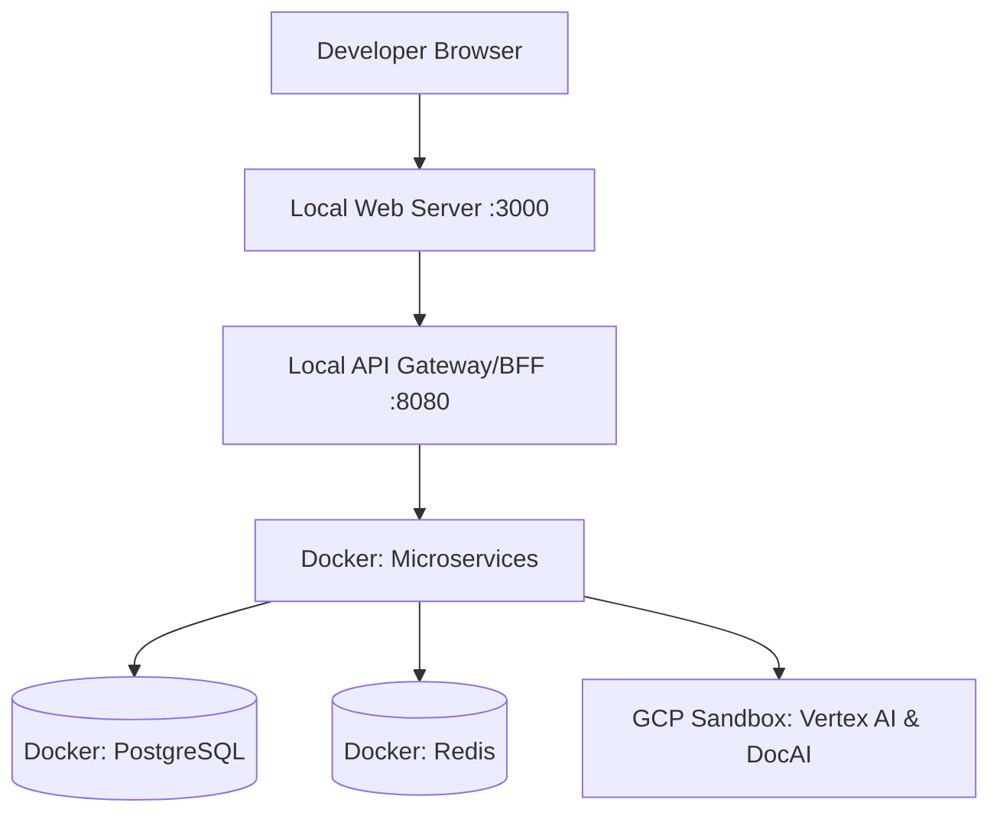
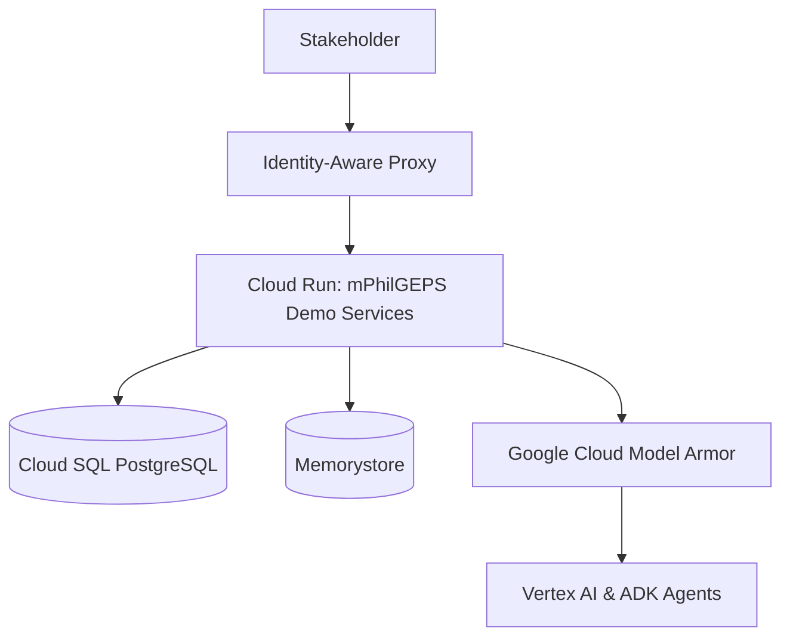
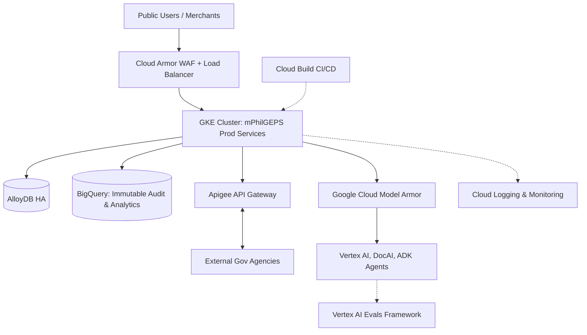

## Goal Description
The objective is to establish the Technical Design Document (TDD) for the Modernized Philippine Government Electronic Procurement System (mPhilGEPS). This document provides the architectural blueprint to transition the business requirements (BRD) into a technical reality. Crucially, the architecture is designed to support three distinct environments: a developer-friendly **Localhost** setup, a cost-effective **GCP Demo** environment for stakeholder validation, and a highly scalable, secure **Production** path on Google Cloud.

## User Review Required
> [!IMPORTANT]
> **Database Selection:** The TDD proposes PostgreSQL as the primary relational database. Please confirm if there are any legacy database compatibility requirements (e.g., Oracle or SQL Server) that would necessitate a different engine or a migration tool like Database Migration Service (DMS).

> [!WARNING]
> **AI API Usage Locally:** The localhost version assumes developers will use their own Google Cloud credentials (`gcloud auth application-default login`) to call Vertex AI and Document AI endpoints, as there are no local emulators for these advanced enterprise models. Please confirm if developer access to a sandbox GCP project is permitted.

## Open Questions
1. **Frontend Tech Stack:** Do you have a preferred frontend framework (e.g., React, Next.js, Angular) for the UI? The TDD currently remains framework-agnostic.
2. **Backend Tech Stack:** For the microservices, what is the preferred programming language (e.g., Go, Python, Node.js)? Python is highly recommended for seamless Vertex AI and Agent Development Kit (ADK) integration.
3. **CI/CD Pipeline:** Do you intend to use Google Cloud Build, GitLab CI/CD, or GitHub Actions for deployment from the `psdbm-philgeps-2026` repository?

---

## Proposed Changes

The system architecture is divided into three evolutionary stages to facilitate rapid development, stakeholder demonstration, and enterprise-grade production deployment.

### 1. Localhost Version (Developer Environment)
This setup ensures developers can build and test rapidly without incurring cloud costs for standard compute and database resources.

#### Infrastructure & Tools
*   **Orchestration:** `Docker Compose` to spin up the entire stack locally.
*   **Frontend & Microservices:** Run natively or inside lightweight Docker containers with hot-reloading.
*   **Database:** Local `PostgreSQL 15+` Docker container.
*   **Cache:** Local `Redis` Docker container for session and catalog caching.

#### AI & Integrations
*   **Gemini & Document AI:** Calls route to a shared "Sandbox" GCP project via Application Default Credentials (ADC).
*   **Multi-Agent ADK:** Runs locally alongside the microservices.

---

### 2. GCP Demo Version (Stakeholder Validation)
A cost-optimized, serverless environment deployed in Google Cloud to demonstrate functionalities (like the Virtual Store and Multi-Agent Chatbot) to PS-DBM executives and COA auditors.

#### Infrastructure & Tools
*   **Compute:** **Cloud Run** (Serverless). Scales to zero when not in use to save costs.
*   **Database:** **Cloud SQL for PostgreSQL** (Basic `db-f1-micro` tier) or AlloyDB Omni.
*   **Cache:** **Memorystore for Redis** (Basic tier).
*   **Storage:** **Cloud Storage** for uploading test eligibility documents.

#### Security & AI
*   **Access Control:** **Identity-Aware Proxy (IAP)** to restrict access only to authorized PS-DBM demo accounts. No public internet access.
*   **Agent Security:** **Google Cloud Model Armor** intercepts all ADK agent inputs/outputs to prevent prompt injection and redact sensitive data (DLP).
*   **AI Integrations:** Live Vertex AI, Document AI, and ADK Agents enabled.

---

### 3. Path to Production (Enterprise Scale)
The enterprise architecture built to handle 3,500 - 5,500 daily concurrent users, 5-second max page loads, and strict compliance with RA 12009.

#### Infrastructure & Tools
*   **Compute:** **Google Kubernetes Engine (GKE)** for high availability, auto-scaling, and microservice orchestration.
*   **Database:** **Cloud SQL HA** (High Availability across zones) or **AlloyDB Enterprise** for massive transactional throughput.
*   **API Management:** **Apigee** for secure, throttled integration with external agencies (SEC, BIR, DTI).
*   **Data Analytics & Fraud:** **BigQuery** serving as the data warehouse for Looker dashboards and BigQuery ML forecasting.

#### Security, AI & Observability
*   **WAF & DDoS Protection:** **Cloud Load Balancing + Cloud Armor** protects the perimeter.
*   **Agent Security (Model Armor):** All interactions with the ADK Multi-Agent System are routed through **Google Cloud Model Armor**, providing robust protection against prompt injection, jailbreaks, and ensuring sensitive PII is redacted before reaching the LLMs.
*   **Agent Evaluation (Evals):** Implementing a continuous **Vertex AI Eval Quality Flywheel**. This framework uses LLM-as-a-judge to score ADK agent responses for groundedness, safety, and helpfulness before and after code changes.
*   **Encryption:** **Cloud KMS** (Customer Managed Encryption Keys) for cryptographic sealing of e-Bids.
*   **Anti-Gravity Maintenance:** PS-DBM Developers use the Anti-Gravity IDE assistant integrated directly with Gemini Enterprise to monitor, debug, and patch the GKE clusters.
*   **Observability & Audit Trails (COA Compliance):** **Cloud Audit Logs** and **Cloud Logging** integrated via OpenTelemetry. A highly secure, append-only sink to **BigQuery** guarantees data immutability for the Commission on Audit (COA).
*   **CI/CD Pipeline:** **Cloud Build** combined with Artifact Registry handles automated testing and zero-downtime rolling deployments to GKE.

---

## Verification Plan

### Automated Tests
*   **Unit & Integration Tests:** Run local test suites to verify business logic (e.g., e-Reverse Auction bid validation) using `pytest` or `jest` prior to containerization.
*   **Infrastructure as Code (IaC) Validation:** If using Terraform for GCP deployments, run `terraform plan` and `terraform validate` to ensure cloud architectures conform to the TDD.

### Manual Verification
1.  **Local Environment:** Developer runs `docker-compose up` and confirms the frontend can connect to the local PostgreSQL and Redis containers.
2.  **AI Sandbox Connectivity:** Developer authenticates with `gcloud auth application-default login` and successfully executes a test prompt to the Gemini API.
3.  **Demo Environment Access:** Deploy to Cloud Run, enable IAP, and verify that unauthorized users receive a 403 Forbidden error, while authorized demo users can access the system.
