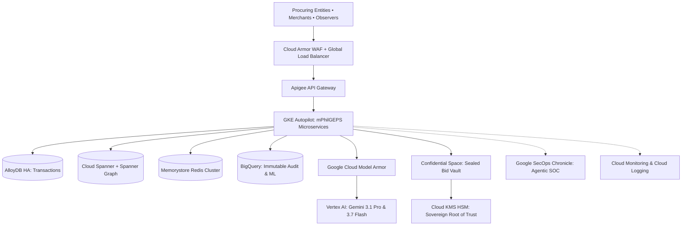
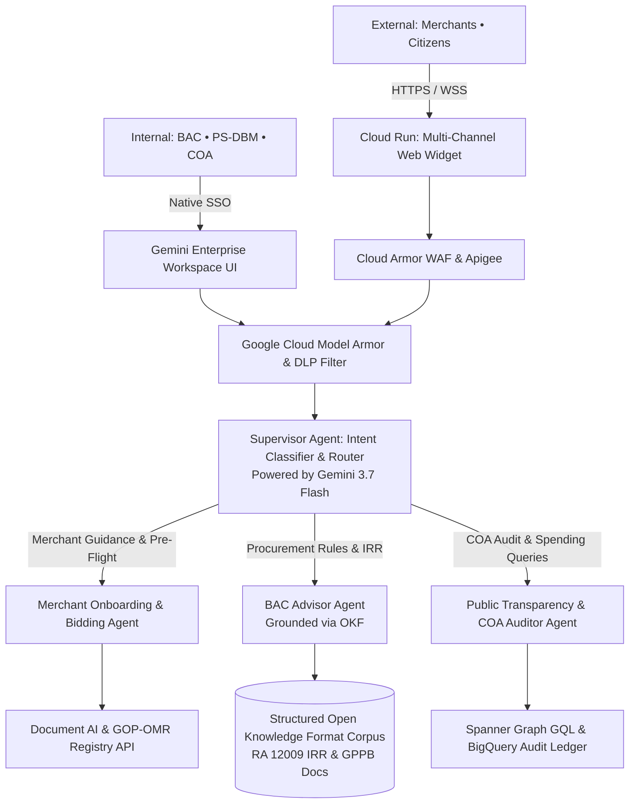
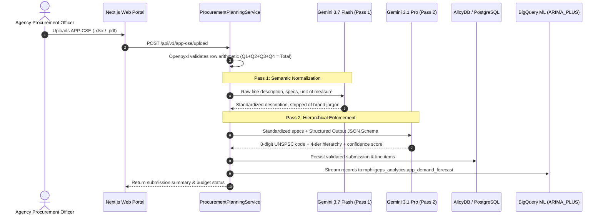
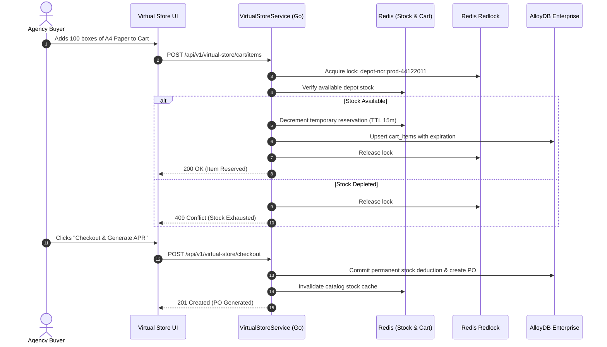
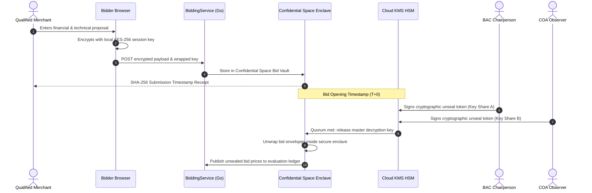
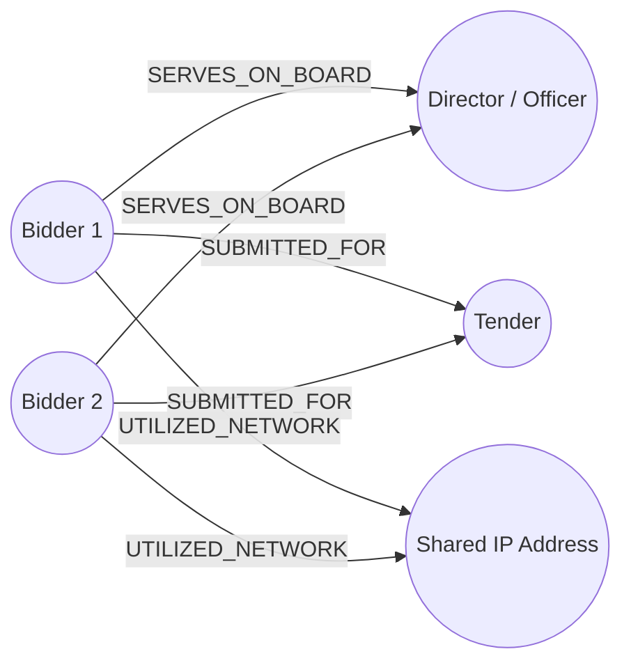

# Technical Design Document (TDD)
## Modernized Philippine Government Electronic Procurement System (mPhilGEPS) Phase 2
**Target Cloud Platform:** Google Cloud Platform, Gemini Enterprise & Google Sovereign AI Stack  
**Reference Document:** Terms of Reference (TOR) & PS-DBM Gemini Requirements Architecture v1.0

---

## 1. Goal Description & Core Architectural Thesis

The objective of this Technical Design Document (TDD) is to provide the engineering blueprint for the Modernized Philippine Government Electronic Procurement System (mPhilGEPS Phase 2) in strict compliance with the **New Government Procurement Act (RA 12009 / NGPA)** and the **Data Privacy Act (RA 10173)**.

### 📌 Core Architectural Thesis
Rather than bolting disparate third-party AI APIs onto legacy relational databases, **mPhilGEPS Phase 2 leverages in-database AI processing (BigQuery ML and Spanner Graph) paired with Gemini 3.1 Pro (heavy reasoning) and Gemini 3.7 Flash (sub-second transactional inference)**. 

This architecture maintains end-to-end sovereign data residency under RA 10173, isolates unopened bids cryptographically inside a Confidential Space vault, and scales seamlessly to support peak loads exceeding **5,500 concurrent users** with sub-second responsiveness.

---

## 2. User Review Required & Open Questions

> [!IMPORTANT]
> **Cloud Spanner & AlloyDB Dual-Storage Strategy:** The production architecture implements **Cloud Spanner + Spanner Graph** for global bid state synchronization, tender cartels, and multi-hop collusion detection, while utilizing **AlloyDB Enterprise / PostgreSQL** for operational microservice persistence (eMarketplace, user accounts, and financial ledgers).

> [!IMPORTANT]
> **Confidential Space Bid Vault:** Electronic bids are encrypted client-side and held within an isolated enclave on Confidential VMs. Private decryption keys reside in Cloud KMS HSM and can only be unsealed at $T+0$ when the BAC Chairperson and COA Observers simultaneously sign the digital release token.

> [!NOTE]
> **Localhost Developer Access:** For local development, engineers can run all relational databases, Redis caches, and microservices in Docker Compose. Gemini 3.x and Document AI endpoints are invoked against a shared GCP Sandbox project via Application Default Credentials (`gcloud auth application-default login`).

---

## 3. Evolutionary Environment Architectures

The system architecture is structured across three evolutionary stages to ensure zero-cost local development, low-cost stakeholder demonstration, and enterprise production scaling.

```
+---------------------------------------------------------------------------------------+
|                                EVOLUTIONARY PIPELINE                                  |
|                                                                                       |
|   1. Localhost (Phase 1)   --->   2. GCP Demo (Phase 4)   --->   3. Production (Phase 5) |
|   - Docker Compose                - Cloud Run (Serverless)       - GKE Autopilot (Multi-Z) |
|   - Local PostgreSQL & Redis      - Cloud SQL & Memorystore      - AlloyDB HA + Spanner   |
|   - Offline Parsers & Mocks       - Identity-Aware Proxy (IAP)   - Spanner Graph + BQ ML  |
|   - Sandbox ADC for Gemini        - Model Armor & Sandbox AI     - Confidential Space Vault|
+---------------------------------------------------------------------------------------+
```

### 3.1 Localhost Version (Developer Environment)
*   **Orchestration:** `docker-compose.local.yml` coordinating microservices, PostgreSQL 15, and Redis 7.
*   **FastAPI & Go Microservices:** Hot-reloading local processes running on host ports (e.g., `:8001` for APP-CSE Planning).
*   **Offline Fallbacks:** Openpyxl spreadsheet parser and local regex/dictionary UNSPSC classifier for testing without internet access.
*   **Sandbox AI:** When enabled, routes to Vertex AI sandbox models via ADC.

### 3.2 GCP Demo Version (Stakeholder Validation)
*   **Compute:** **Cloud Run** (Serverless). Scaled down to zero when idle to minimize cloud expenditure.
*   **Data & Cache:** **Cloud SQL for PostgreSQL** (`db-f1-micro` or `db-custom-2-7680`) and **Memorystore for Redis** (Basic tier).
*   **Access Control:** **Identity-Aware Proxy (IAP)** restricting access strictly to authorized Google Workspace test accounts (`@ps-philgeps.gov.ph`).
*   **Agent Safety:** **Google Cloud Model Armor** proxying all test prompts to evaluate DLP rules and prevent prompt injection.

### 3.3 Path to Production (Enterprise Scale)
*   **Compute:** **Google Kubernetes Engine (GKE Autopilot)** with Dataplane V2 network policies across multiple availability zones.
*   **Storage & In-Database AI:**
    *   **AlloyDB Enterprise HA:** High-throughput transactional data (Virtual Store, wallets, merchant profiles).
    *   **Cloud Spanner + Spanner Graph:** High-consistency contract ledger, bidding transactions, and real-time cartel graph queries.
    *   **BigQuery:** Central data warehouse with BigQuery ML (`ARIMA_PLUS` demand forecasting and clustering anomaly detection).
*   **Perimeter & Edge:** **Cloud Load Balancing** + **Google Cloud Armor** (OWASP Top 10, rate limiting, geo-fencing).
*   **Sovereign Security:** **Confidential Space** on Confidential VMs for bid sealing, **Cloud KMS HSM** (FIPS 140-2 Level 3), and **Google SecOps (Chronicle)** Autonomous Agentic SOC.



---

## 4. Detailed Subsystem Design & Microservices Architecture

### 4.1 Domain-Driven Microservices
1.  **`IdentityAndAccessService` (Go):** User authentication (Cloud Identity), OAuth 2.0 / JWT issuance, Role-Based Access Control (RBAC), and session revocation.
2.  **`MerchantRegistryService` (GOP-OMR - Python/FastAPI):** Supplier registration, Platinum tier validation, Document AI ingestion pipelines, and regulatory API synchronization.
3.  **`ProcurementPlanningService` (Python/FastAPI):** Annual Procurement Plan (APP-CSE) ingestion, spreadsheet arithmetic verification, budget ceiling validation, and dual-pass UNSPSC classification.
4.  **`VirtualStoreService` (Go):** E-commerce catalog browsing, Redis shopping cart management, stock allocation, and purchase request generation.
5.  **`LogisticsAndInventoryService` (Go):** Depot inventory tracking across Main, Regional, and LGU Depots. Subscribes to BigQuery ML demand forecast events for automated stock reordering.
6.  **`BiddingAndAuctionService` (Go):** Electronic tender publication, Confidential Space bid submission, Cloud KMS dual-control quorum unsealing, and live e-Reverse Auctions.
7.  **`CollusionDetectionService` (Python):** Background graph query execution on Cloud Spanner Graph and statistical analysis (Benford's Law and Bid Rotation Index) via BigQuery ML.
8.  **`PaymentAndBillingService` (Go):** Double-entry digital wallet ledgers, Landbank / GovPay payment gateways, and automated disbursement reconciliations.
9.  **`AIOrchestratorService` (Python):** Enterprise Multi-Agent Hub built with Google Antigravity and Agent Builder, managing specialized sub-agents and Structured Open Knowledge Format (OKF) grounding.
10. **`AnalyticsAndAuditService` (Go):** Asynchronous event streamer pushing immutable audit logs into BigQuery for COA inspection and Looker reporting.

---

### 4.2 Multi-Agent Conversational Ecosystem (Antigravity & Agent Builder Hub)

#### Dual-Channel Frontend Deployment Architecture
The multi-agent ecosystem maintains full flexibility to support two concurrent frontend delivery models:
1.  **Gemini Enterprise Frontend (Internal Government Stakeholders):**
    *   **Audience:** PS-DBM Administrators, BAC Members, Secretariat, and COA Auditors.
    *   **Deployment:** Out-of-the-box Gemini Enterprise conversational UI and Google Workspace side-panel integration (Docs, Sheets, Drive).
    *   **Benefits:** Zero frontend engineering overhead, native Workspace identity integration, and direct document grounding without custom UI maintenance.
2.  **Cloud Run Containerized Frontend (Public & Merchant Multi-Channel Portal):**
    *   **Audience:** Registered and prospective suppliers (GOP-OMR), public observers, and citizen monitors.
    *   **Deployment:** Lightweight, responsive Next.js/React chat interface and embeddable web widget deployed as a serverless container on **Cloud Run**.
    *   **Benefits:** Highly cost-efficient (scales to zero when idle), seamlessly absorbs massive traffic spikes exceeding 5,500+ concurrent sessions during bid deadlines, and is securely perimeter-protected by Google Cloud Armor WAF and Apigee.



*   **Supervisor Agent (Intent Classifier & Router):**
    *   Powered by **Gemini 3.7 Flash** for sub-second semantic classification.
    *   Evaluates incoming user prompts and dynamically routes sessions to specialized domain agents without Dialogflow CX overhead.
*   **Merchant Onboarding & Bidding Agent:**
    *   Guides suppliers through Platinum eligibility and tender envelope preparation.
    *   Conducts pre-flight submission audits (*"Your Omnibus Sworn Statement is missing Annex A"* or *"Your Tax Clearance expires in 3 days"*).
*   **Bids and Awards Committee (BAC) Advisor Agent:**
    *   Grounded in the RA 12009 Implementing Rules and Regulations (IRR) and GPPB Standard Bidding Documents.
    *   Assists procurement officers in drafting technical specifications without anti-competitive brand names, calculating statutory evaluation periods, and formulating objective criteria.
*   **Public Transparency & COA Auditor Agent:**
    *   Translates natural language questions from COA personnel, CSOs, and citizens into governed Spanner Graph GQL and BigQuery SQL queries (*"Compare bid price variations for flood control projects across Region III in 2025"*).
*   **Structured Open Knowledge Format (OKF) Grounding:**
    *   To guarantee zero statutory hallucination, regulatory texts are decomposed into OKF chunks carrying rich structural metadata:
        *   `section`: Article or Section number of RA 12009.
        *   `subsection`: Specific clause.
        *   `amendment_date`: Date of latest GPPB resolution.
        *   `applicability`: Types of procurement (Goods, Infrastructure, Consulting).

---

## 5. Subsystem Deep Dive: APP-CSE Submission Portal & AI Classification

### 5.1 Dual-Pass Extraction & Hierarchical UNSPSC Classification Pipeline



#### Deterministic Schema Contract (JSON Schema):
```json
{
  "type": "object",
  "properties": {
    "unspsc_code": { "type": "string", "pattern": "^[0-9]{8}$" },
    "hierarchy": {
      "type": "object",
      "properties": {
        "segment": { "type": "string" },
        "family": { "type": "string" },
        "class": { "type": "string" },
        "commodity": { "type": "string" }
      },
      "required": ["segment", "family", "class", "commodity"]
    },
    "confidence_score": { "type": "number", "minimum": 0.0, "maximum": 1.0 },
    "extracted_specifications": {
      "type": "object",
      "properties": {
        "form_factor": { "type": "string" },
        "processor_class": { "type": "string" },
        "memory_gb": { "type": "integer" }
      }
    }
  },
  "required": ["unspsc_code", "hierarchy", "confidence_score", "extracted_specifications"]
}
```

#### Vendor-Tender Matching (Vertex AI Vector Search):
*   Historical awards and GOP-OMR merchandise profiles are embedded using `text-embedding-005` (768 or 1536 dimensions) and indexed in Vertex AI Vector Search.
*   Upon Invitation to Bid (ITB) publication, nearest-neighbor vector search computes matches in milliseconds, pushing proactive notifications to accredited suppliers.

### 5.2 BigQuery ML `ARIMA_PLUS` In-Database Demand Forecasting
```sql
CREATE OR REPLACE MODEL `mphilgeps_analytics.app_demand_forecast`
OPTIONS(
  model_type = 'ARIMA_PLUS',
  time_series_timestamp_col = 'procurement_date',
  time_series_data_col = 'total_expenditure',
  time_series_id_col = 'unspsc_commodity_code',
  holiday_region = 'PH'
) AS
SELECT
  procurement_date,
  unspsc_commodity_code,
  total_expenditure
FROM
  `mphilgeps_dw.historical_purchase_orders`;
```
*   **MLOps Pipeline (Vertex AI Pipelines / Kubeflow):** Automated feature drift detection handles macroeconomic disruptions; automatically updates regional depot replenishment triggers.

### 5.3 Database Schema (DDL)
```sql
CREATE TABLE app_cse_submissions (
    id UUID PRIMARY KEY DEFAULT gen_random_uuid(),
    agency_id VARCHAR(64) NOT NULL,
    fiscal_year INT NOT NULL,
    status VARCHAR(32) NOT NULL DEFAULT 'DRAFT', -- DRAFT, PROCESSING, VALIDATED, SUBMITTED
    gcs_raw_uri TEXT NOT NULL,
    total_estimated_budget NUMERIC(15, 2) DEFAULT 0.00,
    allocated_budget NUMERIC(15, 2) DEFAULT 0.00,
    submission_hash VARCHAR(64),
    created_at TIMESTAMP WITH TIME ZONE DEFAULT NOW()
);

CREATE TABLE app_cse_items (
    id UUID PRIMARY KEY DEFAULT gen_random_uuid(),
    submission_id UUID NOT NULL REFERENCES app_cse_submissions(id) ON DELETE CASCADE,
    item_code VARCHAR(64),
    unspsc_code VARCHAR(16) NOT NULL,
    raw_description TEXT NOT NULL,
    standardized_description TEXT,
    unit_of_measure VARCHAR(32) NOT NULL,
    unit_price NUMERIC(12, 2) NOT NULL,
    q1_qty INT DEFAULT 0,
    q2_qty INT DEFAULT 0,
    q3_qty INT DEFAULT 0,
    q4_qty INT DEFAULT 0,
    total_qty INT GENERATED ALWAYS AS (q1_qty + q2_qty + q3_qty + q4_qty) STORED,
    total_amount NUMERIC(15, 2) GENERATED ALWAYS AS ((q1_qty + q2_qty + q3_qty + q4_qty) * unit_price) STORED,
    preferred_depot_id VARCHAR(32) NOT NULL,
    confidence_score NUMERIC(4, 3)
);
```

---

## 6. Subsystem Deep Dive: Virtual Store & eMarketplace

### 6.1 Architecture & Two-Tier Inventory Reservation
*   **Tier 1 (Redis Redlock):** Sub-second distributed temporary hold (TTL: 15 minutes) when items are placed in cart.
*   **Tier 2 (Database Fallback):** Pessimistic row lock (`SELECT ... FOR UPDATE NOWAIT`) on AlloyDB `product_depot_inventory` if Redis partitions, guaranteeing zero duplicate allocation.



---

## 7. Subsystem Deep Dive: GOP-OMR & Automated Document Verification

### 7.1 Verification Architecture Matrix

| Document Type | Extractor Engine | Target Fields for Verification | Statutory Cross-Validation Rule Check |
| :--- | :--- | :--- | :--- |
| **SEC General Information Sheet (GIS)** | Document AI Custom Extractor (CDE) | Corporate Name, SEC Reg No., Board of Directors, Stockholders, Equity Breakdown | Validates against **60/40 Filipino ownership threshold**; flags shared officers/directors with other competing bidding firms. |
| **DTI Business Registration** | Document AI CDE | Business Name, Owner Name, Certificate Scope, Validity Period | Verifies business active status and cross-checks owner against GPPB debarment/blacklist database. |
| **BIR Tax Clearance** | Document AI Form Parser | Tax Clearance No., Certificate Date, Expiration Date, TIN | Validates certificate authenticity via cryptographic barcode and ensures certificate is active on bid date. |
| **PCAB Construction License** | Document AI CDE | License Number, Classification, Category (AAA/AA/A), Expiry Date | Checks that contractor capacity matches or exceeds the Approved Budget for the Contract (ABC). |
| **Audited Financial Statements (AFS)** | Document AI Layout Parser + **Gemini 3.1 Pro** | Current Assets, Current Liabilities, Net Worth, Value of Outstanding Works | Automatically calculates **Net Financial Contracting Capacity (NFCC)**: <br>$$NFCC = [(\text{Current Assets} - \text{Current Liabilities}) \times 15] - \text{Outstanding Works}$$ |

### 7.2 Audit Decisioning Engine (Gemini 3.7 Flash)
*   **Engine Function:** Aggregates JSON payloads from Document AI and executes automated mathematical and date audits.
*   **Audit Logic:**
    1.  Validates that calculated NFCC $\ge$ ABC.
    2.  Confirms document validity periods extend past the tender opening timestamp.
    3.  Outputs structured evaluation status: `APPROVED`, `FLAGGED`, or `REJECTED_WITH_REASON`.

```sql
CREATE TABLE merchants (
    id VARCHAR(64) PRIMARY KEY,
    business_name VARCHAR(255) NOT NULL,
    tin VARCHAR(32) UNIQUE NOT NULL,
    registration_type VARCHAR(32) NOT NULL, -- DTI, SEC, CDA
    registration_number VARCHAR(64) NOT NULL,
    filipino_equity_percentage NUMERIC(5, 2) NOT NULL,
    membership_tier VARCHAR(16) NOT NULL DEFAULT 'RED', -- RED, PLATINUM
    is_blacklisted BOOLEAN DEFAULT FALSE,
    created_at TIMESTAMP WITH TIME ZONE DEFAULT NOW()
);

CREATE TABLE merchant_verifications (
    id UUID PRIMARY KEY DEFAULT gen_random_uuid(),
    merchant_id VARCHAR(64) REFERENCES merchants(id),
    document_type VARCHAR(32) NOT NULL,
    extracted_data JSONB NOT NULL,
    calculated_nfcc NUMERIC(15, 2),
    decision_status VARCHAR(32) NOT NULL, -- APPROVED, FLAGGED, REJECTED_WITH_REASON
    decision_reason TEXT,
    verified_at TIMESTAMP WITH TIME ZONE DEFAULT NOW()
);
```

---

## 8. Subsystem Deep Dive: Confidential e-Bidding & e-Reverse Auction

### 8.1 Confidential Space Bid Vault & Cryptographic Quorum
*   **Client-Side Sealing:** Merchants generate a local AES-256 session key, encrypt their Technical and Financial bid packages in the browser, and upload ciphertext to the Cloud Storage Bid Vault.
*   **Confidential VMs (Confidential Space):** The bid vault runs in hardware-isolated Confidential Space enclaves where memory is encrypted using AMD SEV-SNP.
*   **Dual-Control KMS Quorum:** The master decryption key in **Cloud KMS HSM** is locked until the BAC Chairperson and COA Observers simultaneously sign the digital release token at bid opening timestamp ($T+0$).



### 8.2 Real-Time e-Reverse Auction Engine
*   **Anti-Sniping Clock Extension:** If a lower bid is submitted within the final 2 minutes of the auction clock, the auction countdown automatically extends by an additional 2 minutes.
*   **Redis `ZSET` Ticker:** High-frequency bid ranking maintained in Redis Sorted Sets (`ZSET`) with WebSocket updates streamed to bidders.

---

## 9. Subsystem Deep Dive: Graph-Based Anti-Collusion & Anomaly Detection

### 9.1 Spanner Graph Schema & GQL Queries
To detect phantom competitors, cover bidding, and circular bidder rotation, Cloud Spanner Graph models relationships across entities:



*   **Spanner Graph Model Definition:**
    *   **Nodes:** `Bidder`, `Director`, `Authorized_Signatory`, `Bank_Guarantor`, `IP_Address`, `Physical_Address`, `Tender`.
    *   **Edges:** `SUBMITTED_FOR`, `SERVES_ON_BOARD`, `REGISTERED_WITH_ADDRESS`, `UTILIZED_NETWORK`, `FINANCIALLY_BACKED_BY`.
*   **Spanner GQL Pattern Detection Query:**
```sql
GRAPH MPhilGepsProcurementGraph
MATCH
  (b1:Bidder)-[:SERVES_ON_BOARD]->(d:Director)<-[:SERVES_ON_BOARD]-(b2:Bidder),
  (b1)-[:SUBMITTED_FOR]->(t:Tender)<-[:SUBMITTED_FOR]-(b2)
WHERE b1.id != b2.id
RETURN b1.company_name, b2.company_name, d.full_name, t.reference_number;
```

### 9.2 Statistical Anomaly Metrics (BigQuery ML)
*   **Bid Rotation Index (Collusion Probability Index - CPI):** BigQuery ML clustering algorithms analyze historical tender wins within specific geographic zones. When firms alternate winning bids with statistical precision, the algorithm assigns a high CPI score.
*   **Benford's Law & Line-Item Pricing Variance:** Analyzes unit pricing distributions against Benford's Law and flags bids where competing bidders exhibit identical line-item decimal anomalies or synthetic variance patterns.

---

## 10. Subsystem Deep Dive: e-Payment & Double-Entry Wallet Ledger

```sql
CREATE TABLE agency_wallets (
    id VARCHAR(64) PRIMARY KEY,
    agency_id VARCHAR(64) UNIQUE NOT NULL,
    current_balance NUMERIC(15, 2) NOT NULL DEFAULT 0.00 CHECK (current_balance >= 0.00),
    currency VARCHAR(3) DEFAULT 'PHP',
    updated_at TIMESTAMP WITH TIME ZONE DEFAULT NOW()
);

CREATE TABLE wallet_ledger (
    id UUID PRIMARY KEY DEFAULT gen_random_uuid(),
    wallet_id VARCHAR(64) NOT NULL REFERENCES agency_wallets(id),
    transaction_type VARCHAR(16) NOT NULL, -- CREDIT, DEBIT
    amount NUMERIC(15, 2) NOT NULL CHECK (amount > 0.00),
    reference_order_id VARCHAR(64),
    idempotency_key VARCHAR(128) UNIQUE NOT NULL,
    description TEXT,
    created_at TIMESTAMP WITH TIME ZONE DEFAULT NOW()
);

CREATE INDEX idx_wallet_ledger_wallet ON wallet_ledger(wallet_id);
```

---

## 11. Enterprise Security, Sovereign Governance & Autonomous Agentic SOC

### 11.1 Autonomous Agentic SOC (Google SecOps / Chronicle + Gemini)
*   **High-Volume EPS Telemetry:** Ingests tens of thousands of electronic procurement system (EPS) events per second into Google SecOps (Chronicle).
*   **Gemini Agentic SOC Loop:**
    *   Autonomous triage of abnormal database read queries on tender pricing tables prior to bid opening.
    *   Detects brute-force credential enumeration and access attempts originating outside whitelisted sovereign boundaries.
    *   Triggers automated real-time quarantine of compromised API keys and user credentials.

### 11.2 Model Armor & Data Privacy (RA 10173)
*   **Inspection:** Every prompt and inference output is inspected by **Google Cloud Model Armor**.
*   **PII Masking:** Automatic redaction of Tax Identification Numbers (TIN), mobile numbers, bank accounts, and confidential internal reserve prices.
*   **Prompt Injection Mitigation:** Protects agents from jailbreaks attempting to manipulate bidding evaluation scores or extract internal BAC deliberations.

### 11.3 10-Year Tamper-Proof Audit & Record Retention (RA 12009 / COA)
*   **Cloud Storage Bucket Lock:** Object Retention in Compliance Mode (10-year non-erasable duration) for all submitted tender dossiers, bids, and APP-CSEs.
*   **BigQuery Immutable Sinks:** All audit events streamed to append-only BigQuery tables with row-level hashing for COA verification.

---

## 12. Non-Functional Requirements & Performance Sizing Parameters

| Metric / Parameter | SLA Target | Technical Implementation |
| :--- | :--- | :--- |
| **Baseline Concurrency** | 3,500 active sessions | GKE Autopilot node auto-provisioning & Cloud Spanner baseline nodes. |
| **Peak Surge Concurrency** | 5,500 active sessions | Horizontal Pod Autoscaling (HPA) & Cloud Spanner automated scaling. |
| **Interactive UI Searches** | $< 1,000\text{ ms}$ | Cloud CDN, Memorystore Redis, and Gemini 3.7 Flash sub-second inference. |
| **Batch Document Parsing** | $< 15\text{ seconds}$ per 20-page doc | Asynchronous Cloud Pub/Sub + Document AI CDE pipeline. |
| **Collusion Graph Queries** | $< 60\text{ seconds}$ | Spanner Graph distributed GQL pattern matching & BigQuery ML clustering. |
| **Page Display SLA** | $< 5\text{ seconds}$ during peak | Static asset caching on Cloud CDN and optimized Next.js server-side rendering. |
| **Availability & Uptime** | $99.9\%$ (24x7) | Multi-Region Active-Passive (`asia-southeast1` primary, `asia-southeast2` secondary). |
| **Disaster Recovery** | RPO $< 15\text{ mins}$, RTO $< 1\text{ hour}$ | Asynchronous replication & Cloud DNS automated failover. |

---

## 13. Verification & Testing Plan

### 13.1 Automated Testing Suite
*   **Unit & Arithmetic Validation:** `pytest` testing line item quarterly formulas, budget ceiling overflow, and UNSPSC classification inside `services/procurement-planning`.
*   **Collusion Graph Integration:** Pytest fixtures executing GQL queries against Spanner Graph emulators to verify multi-hop detection of shared directors.
*   **Model Armor Security Scans:** Automated red-teaming test suites injecting malicious prompts and testing PII masking against RA 10173 rules.
*   **Continuous Integration:** Google Cloud Build pipeline triggering upon Git commits to `origin/main`.

### 13.2 Manual Verification Walkthrough
1.  **Local Execution:** Run `docker compose -f docker-compose.local.yml up` and test the APP-CSE drag-and-drop web portal on `http://localhost:8001`.
2.  **Dual-Pass Verification:** Ingest `sample_app_cse_2026.xlsx` and verify Pass 1 semantic normalization and Pass 2 hierarchical UNSPSC mapping.
3.  **Confidential Bid Sealing:** Verify client-side encryption and Cloud KMS dual-control token unsealing mock.
