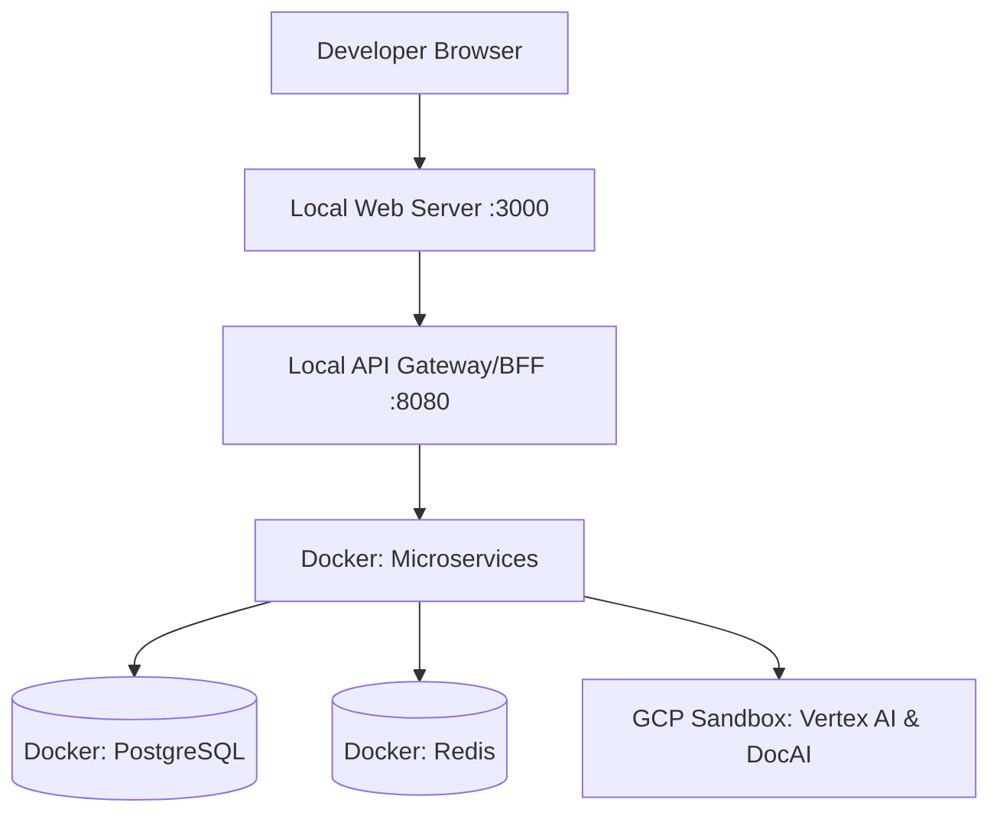
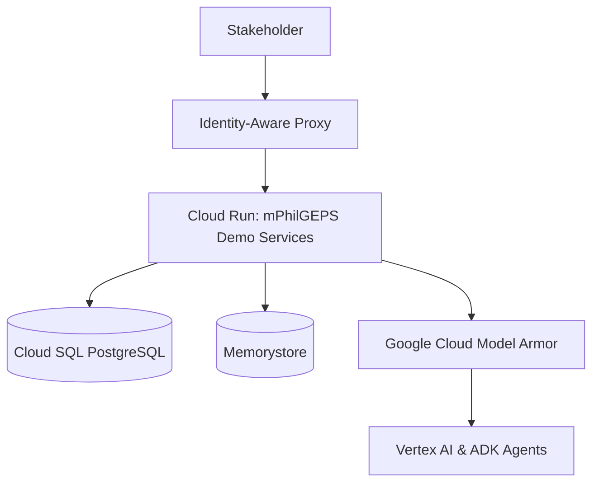
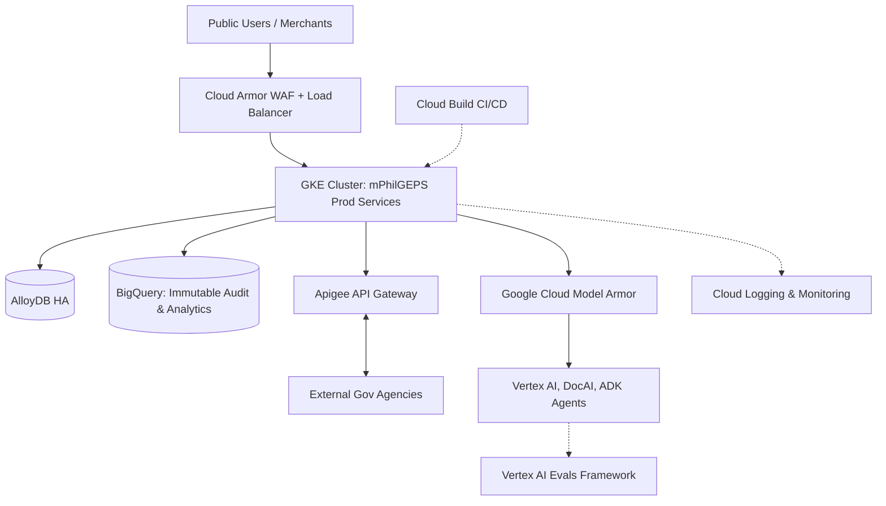
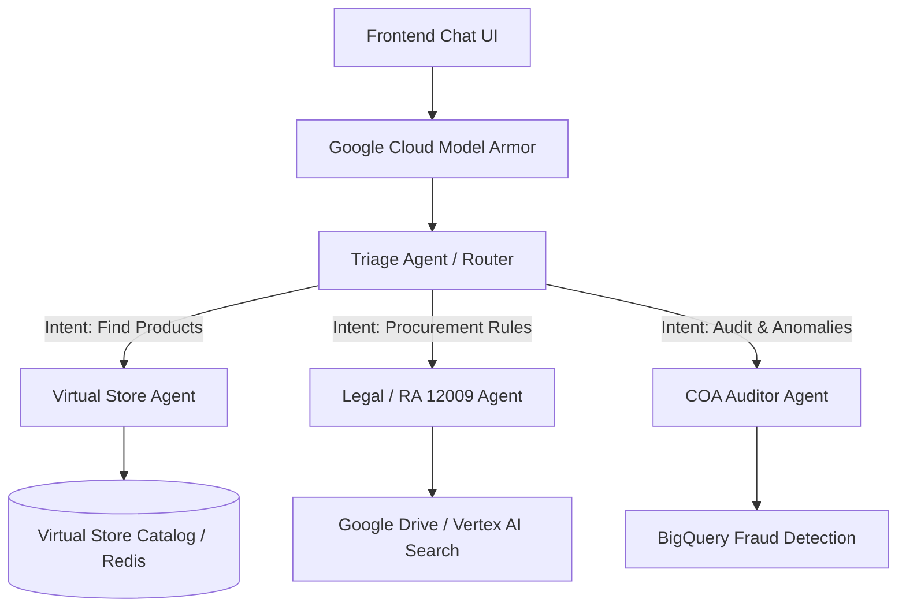
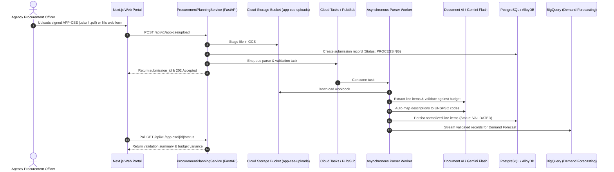

## Goal Description
The objective is to establish the Technical Design Document (TDD) for the Modernized Philippine Government Electronic Procurement System (mPhilGEPS). This document provides the architectural blueprint to transition the business requirements (BRD) into a technical reality. Crucially, the architecture is designed to support three distinct environments: a developer-friendly **Localhost** setup, a cost-effective **GCP Demo** environment for stakeholder validation, and a highly scalable, secure **Production** path on Google Cloud.

## User Review Required
> [!IMPORTANT]
> **Database Selection:** The TDD proposes PostgreSQL as the primary relational database. Please confirm if there are any legacy database compatibility requirements (e.g., Oracle or SQL Server) that would necessitate a different engine or a migration tool like Database Migration Service (DMS).

> [!WARNING]
> **AI API Usage Locally:** The localhost version assumes developers will use their own Google Cloud credentials (`gcloud auth application-default login`) to call Vertex AI and Document AI endpoints, as there are no local emulators for these advanced enterprise models. Please confirm if developer access to a sandbox GCP project is permitted.

## Open Questions
1. **Frontend Tech Stack:** Do you have a preferred frontend framework (e.g., React, Next.js, Angular) for the UI? The TDD currently remains framework-agnostic.
2. **Backend Tech Stack:** For the microservices, what is the preferred programming language (e.g., Go, Python, Node.js)? Python is highly recommended for seamless Vertex AI and Agent Development Kit (ADK) integration.
3. **CI/CD Pipeline:** Do you intend to use Google Cloud Build, GitLab CI/CD, or GitHub Actions for deployment from the `psdbm-philgeps-2026` repository?

---

## Proposed Changes

The system architecture is divided into three evolutionary stages to facilitate rapid development, stakeholder demonstration, and enterprise-grade production deployment.

### 1. Localhost Version (Developer Environment)
This setup ensures developers can build and test rapidly without incurring cloud costs for standard compute and database resources.

#### Infrastructure & Tools
*   **Orchestration:** `Docker Compose` to spin up the entire stack locally.
*   **Frontend & Microservices:** Run natively or inside lightweight Docker containers with hot-reloading.
*   **Database:** Local `PostgreSQL 15+` Docker container.
*   **Cache:** Local `Redis` Docker container for session and catalog caching.

#### AI & Integrations
*   **Gemini & Document AI:** Calls route to a shared "Sandbox" GCP project via Application Default Credentials (ADC).
*   **Multi-Agent ADK:** Runs locally alongside the microservices.



---

### 2. GCP Demo Version (Stakeholder Validation)
A cost-optimized, serverless environment deployed in Google Cloud to demonstrate functionalities (like the Virtual Store and Multi-Agent Chatbot) to PS-DBM executives and COA auditors.

#### Infrastructure & Tools
*   **Compute:** **Cloud Run** (Serverless). Scales to zero when not in use to save costs.
*   **Database:** **Cloud SQL for PostgreSQL** (Basic `db-f1-micro` tier) or AlloyDB Omni.
*   **Cache:** **Memorystore for Redis** (Basic tier).
*   **Storage:** **Cloud Storage** for uploading test eligibility documents.

#### Security & AI
*   **Access Control:** **Identity-Aware Proxy (IAP)** to restrict access only to authorized PS-DBM demo accounts. No public internet access.
*   **Agent Security:** **Google Cloud Model Armor** intercepts all ADK agent inputs/outputs to prevent prompt injection and redact sensitive data (DLP).
*   **AI Integrations:** Live Vertex AI, Document AI, and ADK Agents enabled.



---

### 3. Path to Production (Enterprise Scale)
The enterprise architecture built to handle 3,500 - 5,500 daily concurrent users, 5-second max page loads, and strict compliance with RA 12009.

#### Infrastructure & Tools
*   **Compute:** **Google Kubernetes Engine (GKE)** for high availability, auto-scaling, and microservice orchestration.
*   **Database:** **Cloud SQL HA** (High Availability across zones) or **AlloyDB Enterprise** for massive transactional throughput.
*   **API Management:** **Apigee** for secure, throttled integration with external agencies (SEC, BIR, DTI).
*   **Data Analytics & Fraud:** **BigQuery** serving as the data warehouse for Looker dashboards and BigQuery ML forecasting.

#### Security, AI & Observability
*   **WAF & DDoS Protection:** **Cloud Load Balancing + Cloud Armor** protects the perimeter.
*   **Agent Security (Model Armor):** All interactions with the ADK Multi-Agent System are routed through **Google Cloud Model Armor**, providing robust protection against prompt injection, jailbreaks, and ensuring sensitive PII is redacted before reaching the LLMs.
*   **Agent Evaluation (Evals):** Implementing a continuous **Vertex AI Eval Quality Flywheel**. This framework uses LLM-as-a-judge to score ADK agent responses for groundedness, safety, and helpfulness before and after code changes.
*   **Encryption:** **Cloud KMS** (Customer Managed Encryption Keys) for cryptographic sealing of e-Bids.
*   **Anti-Gravity Maintenance:** PS-DBM Developers use the Anti-Gravity IDE assistant integrated directly with Gemini Enterprise to monitor, debug, and patch the GKE clusters.
*   **Observability & Audit Trails (COA Compliance):** **Cloud Audit Logs** and **Cloud Logging** integrated via OpenTelemetry. A highly secure, append-only sink to **BigQuery** guarantees data immutability for the Commission on Audit (COA).
*   **CI/CD Pipeline:** **Cloud Build** combined with Artifact Registry handles automated testing and zero-downtime rolling deployments to GKE.



---


---

## Detailed Subsystem Design

To provide a deeper understanding of the implementation, this section breaks down the specific microservices, database schemas, and the Multi-Agent System topology required to fulfill the BRD.

### 4.1 Microservices Architecture
To fully support the Core Functional Requirements outlined in the BRD, the system will be decoupled into the following domain-driven microservices. We recommend **Python (FastAPI)** for AI-heavy services and **Go** for high-throughput transactional services.

*   **`IdentityAndAccessService`:** Manages user authentication (Cloud Identity), Role-Based Access Control (RBAC), and session JWTs.
*   **`MerchantRegistryService` (GOP-OMR):** Handles supplier registration, Platinum Eligibility upgrades, and integrates with Document AI to automatically extract and verify business permits.
*   **`ProcurementPlanningService`:** Manages the submission, validation, and consolidation of the Annual Procurement Plan for Common-Use Supplies and Equipment (APP-CSE) for all government agencies.
*   **`VirtualStoreService`:** Powers the eMarketplace frontend. Handles catalog browsing, cart management, and order placement. Heavily utilizes Redis for sub-second caching.
*   **`LogisticsAndInventoryService`:** Tracks physical stock levels across the Main, Regional, and LGU Depots. Integrates with BigQuery ML for predictive demand forecasting to prevent stockouts.
*   **`BiddingAndAuctionService`:** Manages the entire lifecycle of procurement projects, including e-bidding, smart contracts, e-Reverse Auctions, and electronic bid sealing (via Cloud KMS).
*   **`PaymentAndBillingService`:** Manages digital wallets, electronic payments, and integrations with external gateways (e.g., LBP e-Payment, GovPay, LDDAP-ADA).
*   **`AIOrchestratorService`:** The dedicated Python backend hosting the Agent Development Kit (ADK) runtime, Vertex AI search grounding, and routing for all Multi-Agent interactions.
*   **`AnalyticsAndAuditService`:** An asynchronous service responsible for funneling transactional logs into BigQuery for COA audit trails, Looker dashboards, and fraud anomaly detection.

### 4.2 Database Schema (High-Level)
The primary relational database (PostgreSQL/AlloyDB) will be structured to enforce strict referential integrity.

*   `users`: Stores PS-DBM admins, agency buyers, and COA auditors.
*   `merchants`: Stores registered suppliers (GOP-OMR) and their eligibility status (linked to SEC/BIR integrations).
*   `app_cse_submissions`: Stores the Annual Procurement Plans submitted by agencies, containing line items for demand forecasting.
*   `bids`: Stores encrypted bid payloads, timestamped, with foreign keys linking back to `merchants` and specific procurement projects.
*   `audit_ledger`: An append-only table (mirrored to BigQuery) capturing every state change to a bid or merchant status.

### 4.3 Multi-Agent ADK Topology (The AI Engine)
Instead of a monolithic chatbot or Dialogflow CX, the AI engine is a distributed, multi-agent system built on Google's ADK.



*   **Triage Agent (Router):** Uses a fast model (e.g., Gemini 2.0 Flash) to instantly classify user intent and route the query to the correct specialized sub-agent.
*   **Virtual Store Agent:** Capable of executing SQL/API calls to query the catalog (e.g., "Find me the top 3 cheapest laptops that meet these specs").
*   **Legal / RA 12009 Agent:** Grounded in a Vertex AI Search corpus containing the full text of Republic Act 12009 and historical GPPB resolutions.
*   **COA Auditor Agent:** Synthesizes complex anomaly detection reports from BigQuery ML into readable narratives for investigators.


---

## 5. Subsystem Deep Dive: APP-CSE Submission Portal

To illustrate the concrete implementation path, this section provides the code-ready technical design for the **APP-CSE (Annual Procurement Plan - Common-Use Supplies and Equipment) Submission Portal**.

### 5.1 Architecture & End-to-End Sequence


### 5.2 Frontend Component Architecture
*   **`AppCseUploaderComponent`:** Drag-and-drop zone with client-side file signature validation (`.xlsx`, `.pdf`), file size limit enforcement (max 25MB), and upload progress reporting.
*   **`AppCseLineItemGrid`:** Virtualized dynamic table (e.g., AG Grid / TanStack Table) allowing agencies to adjust quarterly quantities (Q1–Q4), unit prices, and target delivery depots.
*   **`BudgetValidationBadge`:** Real-time visual indicator comparing the total estimated cost of Common-Use Supplies against the agency's approved budget allocation.

### 5.3 REST API Contracts (OpenAPI)

#### `POST /api/v1/app-cse/upload`
*   **Purpose:** Initial staging of uploaded APP-CSE Excel workbook or PDF.
*   **Request:** `multipart/form-data` with `agency_id`, `fiscal_year`, and `file`.
*   **Response (202 Accepted):**
```json
{
  "submission_id": "cse-2026-0912-abcd",
  "agency_id": "NGA-DEPED-001",
  "fiscal_year": 2026,
  "status": "PROCESSING",
  "file_uri": "gs://mphilgeps-app-cse-uploads/2026/NGA-DEPED-001/app_cse.xlsx",
  "estimated_completion_seconds": 15
}
```

#### `GET /api/v1/app-cse/{submission_id}`
*   **Purpose:** Fetch submission status, extracted line items, and budget validation results.
*   **Response (200 OK):**
```json
{
  "submission_id": "cse-2026-0912-abcd",
  "status": "COMPLETED",
  "total_items": 42,
  "total_estimated_budget": 1250000.00,
  "allocated_budget": 1500000.00,
  "budget_status": "WITHIN_LIMIT",
  "items": [
    {
      "item_code": "44122011-FO-F01",
      "unspsc_code": "44122011",
      "description": "FOLDER, FANCY, A4",
      "q1_qty": 500,
      "q2_qty": 500,
      "q3_qty": 200,
      "q4_qty": 200,
      "total_qty": 1400,
      "unit_price": 42.50,
      "total_amount": 59500.00,
      "preferred_depot": "DEPOT-NCR-MANILA"
    }
  ],
  "validation_errors": []
}
```

#### `POST /api/v1/app-cse/{submission_id}/submit`
*   **Purpose:** Final cryptographic submission and locking of the APP-CSE.
*   **Response:** 200 OK with digital signature hash and submission timestamp.

### 5.4 Database Schema (DDL)

```sql
-- Main APP-CSE Submission Metadata
CREATE TABLE app_cse_submissions (
    id UUID PRIMARY KEY DEFAULT gen_random_uuid(),
    agency_id VARCHAR(64) NOT NULL REFERENCES agencies(id),
    fiscal_year INT NOT NULL,
    status VARCHAR(32) NOT NULL DEFAULT 'DRAFT', -- DRAFT, PROCESSING, VALIDATED, SUBMITTED, REJECTED
    gcs_raw_uri TEXT NOT NULL,
    total_estimated_budget NUMERIC(15, 2) DEFAULT 0.00,
    allocated_budget NUMERIC(15, 2) DEFAULT 0.00,
    submission_hash VARCHAR(64),
    submitted_by UUID REFERENCES users(id),
    created_at TIMESTAMP WITH TIME ZONE DEFAULT NOW(),
    updated_at TIMESTAMP WITH TIME ZONE DEFAULT NOW()
);

-- Individual Normalized Line Items
CREATE TABLE app_cse_items (
    id UUID PRIMARY KEY DEFAULT gen_random_uuid(),
    submission_id UUID NOT NULL REFERENCES app_cse_submissions(id) ON DELETE CASCADE,
    item_code VARCHAR(64),
    unspsc_code VARCHAR(16) NOT NULL,
    raw_description TEXT NOT NULL,
    standardized_description TEXT,
    unit_of_measure VARCHAR(32) NOT NULL,
    unit_price NUMERIC(12, 2) NOT NULL,
    q1_qty INT DEFAULT 0,
    q2_qty INT DEFAULT 0,
    q3_qty INT DEFAULT 0,
    q4_qty INT DEFAULT 0,
    total_qty INT GENERATED ALWAYS AS (q1_qty + q2_qty + q3_qty + q4_qty) STORED,
    total_amount NUMERIC(15, 2) GENERATED ALWAYS AS ((q1_qty + q2_qty + q3_qty + q4_qty) * unit_price) STORED,
    preferred_depot_id VARCHAR(32) NOT NULL,
    confidence_score NUMERIC(4, 3) -- Gemini classification confidence
);

CREATE INDEX idx_app_cse_agency_year ON app_cse_submissions(agency_id, fiscal_year);
CREATE INDEX idx_app_cse_items_submission ON app_cse_items(submission_id);
CREATE INDEX idx_app_cse_items_unspsc ON app_cse_items(unspsc_code);
```

### 5.5 BigQuery Analytics & Demand Forecasting Integration
Once an APP-CSE submission reaches `SUBMITTED` status:
*   An Eventarc event triggers a Cloud Function to stream line items into BigQuery: `mphilgeps_analytics.app_cse_consolidated_demand`.
*   The `ARIMA_PLUS` BigQuery ML model automatically aggregates quarterly regional demand to update minimum stock levels and automated replenishment triggers for each Regional Depot.

## Verification Plan

### Automated Tests
*   **Unit & Integration Tests:** Run local test suites to verify business logic (e.g., e-Reverse Auction bid validation) using `pytest` or `jest` prior to containerization.
*   **Infrastructure as Code (IaC) Validation:** If using Terraform for GCP deployments, run `terraform plan` and `terraform validate` to ensure cloud architectures conform to the TDD.

### Manual Verification
1.  **Local Environment:** Developer runs `docker-compose up` and confirms the frontend can connect to the local PostgreSQL and Redis containers.
2.  **AI Sandbox Connectivity:** Developer authenticates with `gcloud auth application-default login` and successfully executes a test prompt to the Gemini API.
3.  **Demo Environment Access:** Deploy to Cloud Run, enable IAP, and verify that unauthorized users receive a 403 Forbidden error, while authorized demo users can access the system.
