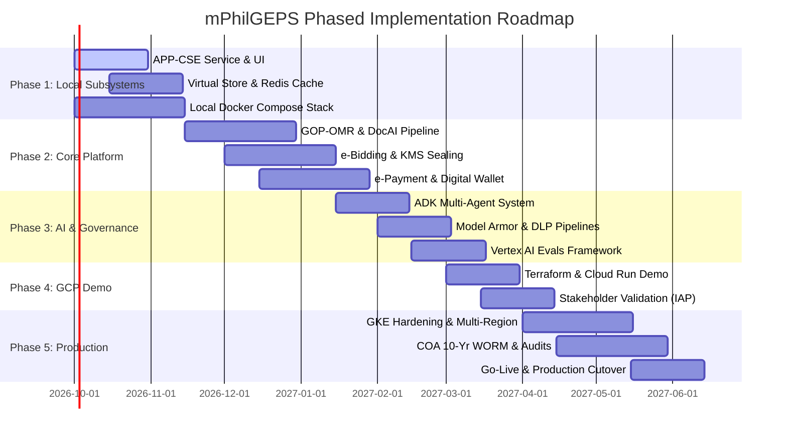

# Modernized Philippine Government Electronic Procurement System (mPhilGEPS)
# Master Implementation & Delivery Plan

**Target Architecture:** Google Cloud Platform (GCP) & Vertex AI  
**Repository:** `markea/psdbm-philgeps-2026`  
**Reference Documents:**  
*   [Business Requirements Document (BRD)](./mPhilGEPS_GoogleCloud_BRD.md)
*   [Technical Design Document (TDD)](./mPhilGEPS_GoogleCloud_TDD.md)

---

## 1. Executive Summary & Strategy

This Implementation Plan defines the technical execution roadmap for developing, testing, deploying, and operating the modernized mPhilGEPS platform. The strategy follows an iterative, phased delivery model designed to de-risk development through early local verification, rapid stakeholder feedback via a serverless GCP Demo tier, and a hardened path to production on Google Kubernetes Engine (GKE).

---

## 2. Phase Breakdown & Work Breakdown Structure (WBS)

### Phase 1: Localhost Foundation & Low-Hanging Fruits (Month 1)
**Objective:** Deliver an offline-first developer experience with working core business logic.
*   **Deliverable 1.1: APP-CSE Microservice (Complete)**
    *   [x] FastAPI backend with `/health`, `/upload`, `/status` endpoints.
    *   [x] Openpyxl parser validating line item quarterly arithmetic ($Q1+Q2+Q3+Q4 = \text{Total}$).
    *   [x] Offline UNSPSC classifier with test fixtures and automated pytest suite.
*   **Deliverable 1.2: APP-CSE Next.js Frontend Portal**
    *   [ ] Drag-and-drop Excel spreadsheet uploader with client-side format checks.
    *   [ ] Dynamic spreadsheet review table with inline quantity adjustments.
    *   [ ] Budget validation pill indicator (Within Limit vs Exceeds Budget).
*   **Deliverable 1.3: Virtual Store & Catalog Microservice**
    *   [ ] Catalog service exposing paginated `/catalog` search backed by PostgreSQL.
    *   [ ] Redis-backed shopping cart and 15-minute temporary inventory reservation lock.
*   **Deliverable 1.4: Unified Local Docker Stack**
    *   [ ] `docker-compose.local.yml` coordinating PostgreSQL 15, Redis 7, and microservices.

### Phase 2: Transactional Engines & Regulatory Gateways (Months 2–3)
**Objective:** Implement statutory procurement workflows and secure integrations.
*   **Deliverable 2.1: GOP-OMR Merchant Registry & Document AI**
    *   [ ] Merchant onboarding stepper (Red vs Platinum Membership).
    *   [ ] Cloud Storage bucket integration for encrypted document staging.
    *   [ ] Document AI Form Parser for Mayor's Permits and Tax Clearances.
    *   [ ] Apigee proxy integration to simulate or connect to SEC, BIR, and DTI APIs.
*   **Deliverable 2.2: e-Bidding & e-Reverse Auction Engine**
    *   [ ] Cryptographic two-envelope bid sealing using Cloud KMS envelope encryption.
    *   [ ] Quorum unsealing mechanism ($M$-of-$N$ threshold) for BAC bid openings.
    *   [ ] WebSocket-based e-Reverse Auction ticker with Redis `ZSET` ranking and 2-minute anti-sniping clock extensions.
*   **Deliverable 2.3: Payment & Financial Billing Service**
    *   [ ] Double-entry wallet ledger schema with strict `idempotency_key` guarantees.
    *   [ ] Integration adapters for Landbank e-Payment and GovPay webhooks.

### Phase 3: AI Stack, Model Armor & Evaluation Quality Flywheel (Months 4–5)
**Objective:** Deploy governed, safe, and continuously evaluated generative AI capabilities.
*   **Deliverable 3.1: ADK Multi-Agent System (MAS)**
    *   [ ] Python-based Agent Development Kit (ADK) service hosting specialized agents:
        *   **Triage Agent:** Intent classification and request routing.
        *   **Virtual Store Agent:** Natural-language product lookup and depot availability.
        *   **Legal / RA 12009 Agent:** Grounded in Vertex AI Search corpus of procurement rules.
        *   **COA Auditor Agent:** Synthesizes fraud detection alerts into plain narratives.
*   **Deliverable 3.2: Google Cloud Model Armor Integration**
    *   [ ] Upstream filter pipelines intercepting all agent prompts and outputs.
    *   [ ] Cloud DLP inspection templates for PH Tax IDs (TIN), PhilSys numbers, and SSS.
*   **Deliverable 3.3: Vertex AI Eval Quality Flywheel**
    *   [ ] Automated LLM-as-a-judge evaluation pipelines scoring agent groundedness and safety.
    *   [ ] Regression testing harness integrated into CI/CD before agent prompt updates.

### Phase 4: GCP Demo Environment & Stakeholder Validation (Month 6)
**Objective:** Stand up a secure, serverless cloud environment for PS-DBM and COA validation.
*   **Deliverable 4.1: Infrastructure as Code (Terraform)**
    *   [ ] Terraform modules for Cloud Run services, Cloud SQL (PostgreSQL), and Memorystore.
    *   [ ] Secret Manager integration for database passwords and API tokens.
*   **Deliverable 4.2: Zero-Trust Access Control**
    *   [ ] Identity-Aware Proxy (IAP) configuration restricting access to authorized Google Workspace users.
*   **Deliverable 4.3: Stakeholder Acceptance Demonstrations**
    *   [ ] Live demonstration of APP-CSE upload, Virtual Store ordering, and AI Triage Chatbot.

### Phase 5: Path to Production & Go-Live (Months 7–8)
**Objective:** Enterprise scaling, high availability, disaster recovery, and final cutover.
*   **Deliverable 5.1: GKE Enterprise Cluster & Zero-Trust Networking**
    *   [ ] Multi-zone GKE Autopilot / Standard cluster deployment.
    *   [ ] Dataplane V2 default-deny network policies between microservice namespaces.
    *   [ ] Cloud Armor WAF and Cloud Load Balancing with DDoS mitigation.
*   **Deliverable 5.2: Disaster Recovery & 10-Year WORM Storage**
    *   [ ] Active-Passive multi-region setup: Primary `asia-southeast1`, Secondary `asia-southeast2`.
    *   [ ] Verified RPO < 15 minutes and RTO < 1 hour failover procedures.
    *   [ ] Cloud Storage Bucket Lock with Object Retention in Compliance Mode (10-year lock).
*   **Deliverable 5.3: Load Testing & Production Cutover**
    *   [ ] Distributed load testing validating 5,500 concurrent users and < 5s page loads.
    *   [ ] Final data migration from legacy PhilGEPS systems via Database Migration Service.

---

## 3. Environment Promotion Matrix

| Capability | Localhost (Phase 1) | GCP Demo (Phase 4) | Production (Phase 5) |
| :--- | :--- | :--- | :--- |
| **Compute** | Docker / Native Host | Cloud Run (Serverless) | Google Kubernetes Engine (GKE) |
| **Relational DB** | Local PostgreSQL 15 / SQLite | Cloud SQL for PostgreSQL | AlloyDB HA / Cloud SQL HA |
| **Caching** | Local Redis Container | Memorystore for Redis | Memorystore HA Cluster |
| **AI / Models** | Offline Mocks / Local ADC | Vertex AI & Gemini Pro | Vertex AI + Model Armor + HSM |
| **Secrets** | `.env.local` | Secret Manager | Secret Manager + CSI Driver |
| **Ingress** | `localhost:3000 / :8001` | Cloud Run + IAP | Cloud Armor WAF + Global LB |
| **DR & Backup** | None | Automated Cloud SQL Backups | Multi-Region Active-Passive (RTO < 1h) |

---

## 4. Risk Registry & Mitigation Strategies

| Risk ID | Description | Impact | Probability | Mitigation Strategy |
| :--- | :--- | :--- | :--- | :--- |
| **RSK-01** | LLM hallucination in procurement law queries | High | Medium | Vertex AI Search grounding strictly against official RA 12009 corpus; Vertex AI Evals pipeline gates releases. |
| **RSK-02** | Prompt injection or PII leakage via chatbot | Critical | Medium | Upstream Google Cloud Model Armor with Cloud DLP templates redacting TIN, PhilSys, and bank details. |
| **RSK-03** | Inventory double-allocation during depot surges | High | Low | Redis Redlock with database-level pessimistic locking (`SELECT FOR UPDATE NOWAIT`) fallback. |
| **RSK-04** | Regional cloud outage during bidding deadlines | Critical | Low | Active-Passive multi-region DR between Singapore and Jakarta with automated Cloud DNS failover. |
| **RSK-05** | Unauthorized unsealing of electronic bids | Critical | Low | Cloud KMS dual-control quorum unsealing requiring $M$-of-$N$ BAC member cryptographic tokens. |

---

## 5. Quality Assurance & Verification Protocols

1.  **Continuous Integration (CI):**
    *   Cloud Build runs linters (`flake8`, `eslint`), unit tests (`pytest`, `jest`), and container image scanning upon every push to `main`.
2.  **Infrastructure as Code (IaC) Validation:**
    *   Terraform code must pass `terraform validate`, `tflint`, and `checkov` security scans.
3.  **Vulnerability & Security Testing:**
    *   Quarterly Vulnerability Assessment and Penetration Testing (VAPT) through Security Command Center and third-party security audits.
4.  **User Acceptance Testing (UAT):**
    *   Structured sign-off gates with PS-DBM procurement officers, BAC secretariats, and COA auditors prior to production cutover.
