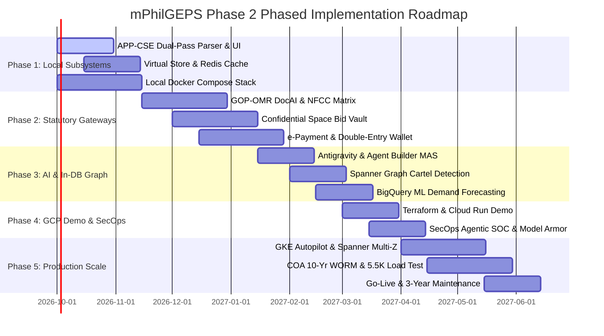

# Modernized Philippine Government Electronic Procurement System (mPhilGEPS) Phase 2
# Master Implementation & Delivery Plan

**Target Architecture:** Google Cloud Platform (GCP), Gemini Enterprise & Sovereign AI Stack  
**Repository:** `markea/psdbm-philgeps-2026`  
**Reference Documents:**  
*   [Business Requirements Document (BRD)](./mPhilGEPS_GoogleCloud_BRD.md)
*   [Technical Design Document (TDD)](./mPhilGEPS_GoogleCloud_TDD.md)
*   Terms of Reference (TOR) & PS-DBM Gemini Requirements Architecture v1.0

---

## 1. Executive Summary & Strategy

This Implementation Plan defines the engineering roadmap to develop, validate, deploy, and operate the modernized mPhilGEPS Phase 2 platform in strict compliance with the **New Government Procurement Act (RA 12009 / NGPA)** and the **Data Privacy Act (RA 10173)**.

### Core Architectural Strategy
The delivery strategy operationalizes in-database AI processing (**Cloud Spanner Graph** and **BigQuery ML**) paired with **Gemini 3.1 Pro** (heavy reasoning) and **Gemini 3.7 Flash** (sub-second transactional inference), while securing sensitive bids in **Confidential Space** enclaves.

---

## 2. Phase Breakdown & Work Breakdown Structure (WBS)

### Phase 1: Localhost Foundation & Dual-Pass AI Extraction (Months 1–2)
**Objective:** Deliver an offline-first developer experience with working core business logic and AI normalization.
*   **Deliverable 1.1: APP-CSE Planning Microservice (Complete)**
    *   [x] FastAPI backend with `/health`, `/upload`, `/status` endpoints.
    *   [x] Openpyxl parser validating line item quarterly arithmetic ($Q1+Q2+Q3+Q4 = \text{Total}$).
    *   [x] Offline UNSPSC dictionary classifier with test fixtures and automated pytest suite.
*   **Deliverable 1.2: Dual-Pass UNSPSC Extraction Engine**
    *   [ ] **Pass 1 (Semantic Normalization):** Gemini 3.7 Flash prompt parsing raw descriptions and stripping colloquial brand names.
    *   [ ] **Pass 2 (Hierarchical Enforcement):** Gemini 3.1 Pro with Structured Output JSON Schema (Segment $\rightarrow$ Family $\rightarrow$ Class $\rightarrow$ Commodity).
    *   [ ] Vertex AI Vector Search prototype indexing merchandise profiles with `text-embedding-005`.
*   **Deliverable 1.3: Virtual Store & Inventory Reservation Service**
    *   [ ] Catalog service exposing paginated `/catalog` search backed by PostgreSQL.
    *   [ ] Redis-backed shopping cart and 15-minute temporary inventory reservation lock (Redlock).
*   **Deliverable 1.4: Unified Local Docker Stack**
    *   [ ] `docker-compose.local.yml` coordinating PostgreSQL 15, Redis 7, and microservices.

### Phase 2: Statutory Gateways, Document Verification & Bid Vault (Months 3–5)
**Objective:** Implement statutory procurement workflows and secure integrations.
*   **Deliverable 2.1: GOP-OMR Document Verification Pipeline**
    *   [ ] Document AI Custom Extractor (CDE) for SEC GIS (60/40 Filipino ownership check and shared directors).
    *   [ ] Document AI CDE for DTI Business Registration (GPPB debarment list cross-checks).
    *   [ ] Document AI Form Parser for BIR Tax Clearance (cryptographic barcode validation).
    *   [ ] Document AI CDE for PCAB Construction Licenses (contractor capacity $\ge$ ABC).
    *   [ ] Document AI Layout Parser + Gemini 3.1 Pro for Audited Financial Statements:
        $$NFCC = [(\text{Current Assets} - \text{Current Liabilities}) \times 15] - \text{Value of Outstanding Works}$$
    *   [ ] Audit Decisioning Engine (Gemini 3.7 Flash) outputting `APPROVED`, `FLAGGED`, or `REJECTED_WITH_REASON`.
*   **Deliverable 2.2: Confidential Space Bid Vault & e-Bidding**
    *   [ ] Client-side AES-256 bid envelope encryption.
    *   [ ] Confidential Space enclave on Confidential VMs for sealed bid storage.
    *   [ ] Cloud KMS HSM dual-control release requiring BAC Chairperson and COA Observer digital tokens at $T+0$.
    *   [ ] WebSocket e-Reverse Auction ticker with Redis `ZSET` ranking and 2-minute anti-sniping clock extensions.
*   **Deliverable 2.3: Payment & Double-Entry Financial Billing Service**
    *   [ ] Double-entry wallet ledger schema with strict `idempotency_key` guarantees.
    *   [ ] Integration adapters for Landbank e-Payment and GovPay webhooks.

### Phase 3: In-Database Graph, AI Stack & Multi-Agent Ecosystem (Months 6–8)
**Objective:** Deploy in-database graph analytics, predictive forecasting, and governed multi-agent workflows.
*   **Deliverable 3.1: Cloud Spanner Graph & Collusion Detection**
    *   [ ] Spanner Graph schema mapping `Bidder`, `Director`, `Authorized_Signatory`, `Bank_Guarantor`, `IP_Address`, `Physical_Address`, and `Tender`.
    *   [ ] GQL queries detecting shared board members submitting for identical tenders.
    *   [ ] BigQuery ML Bid Rotation Index (Collusion Probability Index - CPI) clustering.
    *   [ ] Benford’s Law and line-item decimal anomaly analysis.
*   **Deliverable 3.2: BigQuery ML Demand Forecasting**
    *   [ ] In-database `ARIMA_PLUS` time-series forecasting model with `holiday_region = 'PH'` and Q4 fiscal surge adjustments.
    *   [ ] Vertex AI Pipelines (Kubeflow MLOps) tracking feature drift and updating depot reorder triggers.
*   **Deliverable 3.3: Google Antigravity & Agent Builder Multi-Agent Hub**
    *   [ ] Supervisor Agent (Gemini 3.7 Flash intent classification and sub-second routing).
    *   [ ] Merchant Onboarding & Bidding Agent (pre-flight bid packet completeness checks).
    *   [ ] BAC Advisor Agent (grounded via Structured Open Knowledge Format - OKF in RA 12009 IRR).
    *   [ ] Public Transparency & COA Auditor Agent (natural language to governed Spanner GQL and BigQuery SQL).

### Phase 4: Sovereign Governance, Agentic SOC & GCP Demo Validation (Months 9–11)
**Objective:** Stand up a secure, serverless cloud environment for PS-DBM and COA validation.
*   **Deliverable 4.1: Autonomous Agentic SOC & Security Perimeter**
    *   [ ] Google SecOps (Chronicle) ingestion of tens of thousands of EPS events per second.
    *   [ ] Gemini Agentic SOC Loop for real-time quarantine of compromised credentials and abnormal pricing table reads.
    *   [ ] Google Cloud Model Armor inspecting prompts/outputs and masking TIN, mobile numbers, and bank accounts (RA 10173).
*   **Deliverable 4.2: Infrastructure as Code (Terraform) & Demo Deployment**
    *   [ ] Terraform modules for Cloud Run services, Cloud SQL, Memorystore, and Secret Manager.
    *   [ ] Identity-Aware Proxy (IAP) restricting access to authorized `@ps-philgeps.gov.ph` users.
    *   [ ] Live stakeholder demonstration of APP-CSE upload, Virtual Store checkout, and Agentic Assistant.

### Phase 5: Enterprise Production Scale, DR & 3-Year Maintenance (Months 12–36)
**Objective:** Enterprise scaling, high availability, disaster recovery, and final cutover.
*   **Deliverable 5.1: GKE Autopilot Cluster & Cloud Spanner Autoscaling**
    *   [ ] Multi-zone GKE Autopilot deployment with Dataplane V2 default-deny network policies.
    *   [ ] Cloud Armor WAF and Global Cloud Load Balancing with DDoS mitigation.
    *   [ ] Cloud Spanner autoscaling configured for 3,500 baseline and 5,500 peak concurrent users.
*   **Deliverable 5.2: Disaster Recovery & 10-Year WORM Storage**
    *   [ ] Active-Passive multi-region setup (Primary: `asia-southeast1`, Secondary DR: `asia-southeast2`).
    *   [ ] Verified RPO $< 15\text{ minutes}$ and RTO $< 1\text{ hour}$ automated failover.
    *   [ ] Cloud Storage Bucket Lock with Object Retention in Compliance Mode (10-year non-erasable lock per COA circulars).
*   **Deliverable 5.3: Performance & SLA Verification**
    *   [ ] Interactive UI Searches: $< 1,000\text{ ms}$.
    *   [ ] Batch Document Parsing: $< 15\text{ seconds}$ per 20-page document.
    *   [ ] Collusion Graph Queries: $< 60\text{ seconds}$.
    *   [ ] Final data migration from legacy PhilGEPS 1.5 via Database Migration Service (DMS).
    *   [ ] Operationalization of Antigravity IDE assistant for continuous 3-year system maintenance.

---

## 3. Environment Promotion Matrix

| Capability | Localhost (Phase 1) | GCP Demo (Phase 4) | Production (Phase 5) |
| :--- | :--- | :--- | :--- |
| **Compute** | Docker Compose / Local Host | Cloud Run (Serverless) | Google Kubernetes Engine (GKE Autopilot) |
| **Relational DB** | Local PostgreSQL 15 | Cloud SQL for PostgreSQL | AlloyDB HA (Operations) |
| **Graph & Bids** | Local SQLite Mock | Spanner Emulator / Cloud SQL | Cloud Spanner + Spanner Graph (GQL) |
| **Analytics & ML** | Local Parquet / SQLite | BigQuery Sandbox | BigQuery + BigQuery ML (`ARIMA_PLUS`, PH Holidays) |
| **Caching** | Local Redis Container | Memorystore for Redis | Memorystore HA Cluster |
| **AI Models** | Offline Parsers / ADC Sandbox | Vertex AI & Gemini Pro/Flash | Gemini 3.1 Pro & 3.7 Flash + Model Armor |
| **Bid Security** | Local Mock Key | Cloud KMS Key Wrapping | Confidential Space Vault + Cloud KMS HSM Quorum |
| **Security / SOC** | Local Log Files | Cloud Logging + IAP | Google SecOps (Chronicle) + Gemini SOC Agent |
| **Secrets** | `.env.local` | Secret Manager | Secret Manager + CSI Driver |
| **Ingress** | `localhost:3000 / :8001` | Cloud Run + IAP | Cloud Armor WAF + Global Load Balancer |
| **DR & Backup** | None | Automated Cloud SQL Backups | Multi-Region Active-Passive (RTO < 1h, RPO < 15m) |

---

## 4. Risk Registry & Mitigation Strategies

| Risk ID | Description | Impact | Probability | Mitigation Strategy |
| :--- | :--- | :--- | :--- | :--- |
| **RSK-01** | Statutory hallucination in procurement legal inquiries | High | Low | Grounding via Structured Open Knowledge Format (OKF) with strict section/amendment metadata; Vertex AI Evals gate releases. |
| **RSK-02** | Prompt injection or PII leakage via agentic chat | Critical | Medium | Upstream Google Cloud Model Armor with Cloud DLP templates redacting TIN, PhilSys, and bank account numbers. |
| **RSK-03** | Inventory double-allocation during depot surges | High | Low | Two-tier inventory locking: Redis Redlock with database-level pessimistic fallback (`SELECT ... FOR UPDATE NOWAIT`). |
| **RSK-04** | Market-sensitive bid leaks prior to opening | Critical | Low | Sealed inside Confidential Space on Confidential VMs; Cloud KMS HSM dual-control unsealing requiring BAC + COA simultaneous tokens. |
| **RSK-05** | Spanner Graph query latency on complex cartels | Medium | Medium | Hybrid execution: Nightly scheduled ETL graph pre-computations with on-demand bounded-hop queries ($< 60\text{ seconds}$). |
| **RSK-06** | Regional cloud outage during tender deadlines | Critical | Low | Active-Passive multi-region architecture (Singapore/Jakarta) with automated Cloud DNS health check failover. |

---

## 5. Quality Assurance & Verification Protocols

1.  **Continuous Integration (CI):**
    *   Google Cloud Build runs linters (`flake8`, `golangci-lint`), unit tests (`pytest`, `go test`), and container vulnerability scanning upon every commit to `origin/main`.
2.  **Infrastructure as Code (IaC) Validation:**
    *   Terraform configuration must pass `terraform validate`, `tflint`, and `checkov` security scans.
3.  **Autonomous Agent Evals:**
    *   Employ Vertex AI Eval Quality Flywheel to score agent responses on groundedness, safety, and helpfulness against a benchmark suite of 500+ statutory procurement queries.
4.  **Security & Penetration Testing:**
    *   Vulnerability Assessment and Penetration Testing (VAPT) through Google Security Command Center and certified third-party auditors prior to production cutover.
5.  **User Acceptance Testing (UAT):**
    *   Structured sign-off milestones with PS-DBM leadership, BAC secretariats, and Commission on Audit (COA) representatives.
